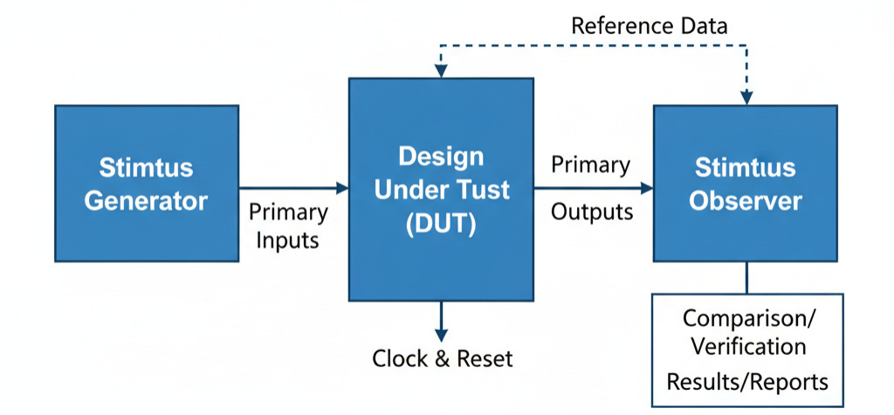
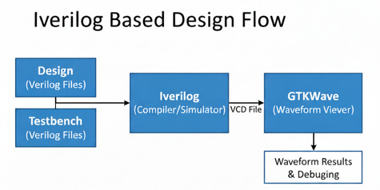

# Day 1 - Introduction to Verilog RTL Design and Synthesis

In this section, we explore the basics of **Verilog simulation** using the open-source tool **Icarus Verilog (iverilog)** and understand the role of **design files** and **testbenches** in RTL design flow.

---

## 🖥️ Simulator
- RTL design is checked for adherence to the specification by **simulating the design**.  
- A **simulator** is the tool used for performing this simulation.  
- In this course, we use **Icarus Verilog (iverilog)** as the simulator.

---

## 📑 Design
- The **design** is the actual Verilog code (or set of codes) which implements the required functionality.  
- The design must meet the **specifications** defined for the hardware.

---

## 🧪 TestBench
- A **testbench** is the setup that applies **stimulus (test vectors)** to the design to verify its functionality.  
- The testbench does not synthesize into hardware; it is only for verification.  

---

## ⚙️ How the Simulator Works
1. The simulator looks for **changes in input signals**.  
2. When an input changes, the corresponding **output is evaluated**.  
3. If there is **no change in the input**, then the output remains the same.  
4. Essentially, the simulator continuously **monitors input changes** to drive the design.  

---

## 📸 Visuals

### 1. Testbench Working
The **testbench setup** consists of:  
- **Stimulus Generator** (applies test vectors to the design)  
- **Design** (implements required logic)  
- **Stimulus Observer** (monitors outputs and verifies correctness)  



---

### 2. Icarus Verilog Design Flow
The Icarus Verilog-based simulation flow consists of:  
- **Design + Testbench** → Compiled by **iverilog**  
- Generates a **VCD (Value Change Dump) file**  
- **GTKWave** reads the VCD file and produces waveform results  



---

## 🔧 Initial Lab Setup

Before starting the labs, we need to set up the working environment and clone the required repository.  

---

### Step 1: Create a working directory
```bash
nidesh@nexus-73:~/Soc/1$ pwd
/home/nidesh/Soc/1
nidesh@nexus-73:~/Soc/1$ mkdir rtl_design_syn_lab
nidesh@nexus-73:~/Soc/1$ ls
rtl_design_syn_lab
nidesh@nexus-73:~/Soc/1$ cd rtl_design_syn_lab/
```

### Step 2: Clone the workshop repository
```bash
git clone https://github.com/kunalg123/sky130RTLDesignAndSynthesisWorkshop.git
cd sky130RTLDesignAndSynthesisWorkshop/
```


Now your folder structure looks like this:
```
sky130RTLDesignAndSynthesisWorkshop/
├── DC_WORKSHOP
├── my_lib
│   ├── lib
│   │   └── sky130_fd_sc_hd__tt_025C_1v80.lib
│   └── verilog_model
├── verilog_files
├── yosys_run.sh
└── README.md
```

### Step 3: Explore the directories

📂 my_lib

Contains all library files required for synthesis.

    Inside lib/ → Standard cell library file:

        sky130_fd_sc_hd__tt_025C_1v80.lib → Timing & power data for standard cells.

    Inside verilog_model/ → All standard cell Verilog models for simulation.

📂 verilog_files

Contains example Verilog designs and their corresponding testbenches.

    Examples include:

        Good/bad cases (good_mux.v, bad_mux.v, etc.)

        Sequential designs (counters, shift registers, FSMs).

        Testbenches (tb_*.v) for verifying each design.

✅ With this setup complete, you are ready to begin the labs using iverilog for simulation and yosys for synthesis in the next steps.


---
