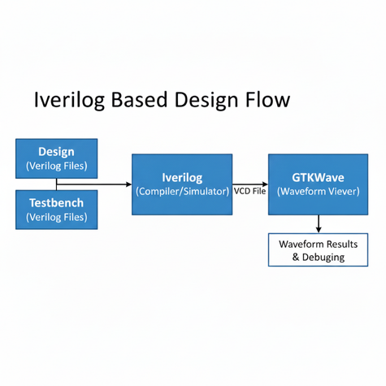

# Day 1 - Introduction to Verilog RTL Design and Synthesis

In this section, we explore the basics of **Verilog simulation** using the open-source tool **Icarus Verilog (iverilog)** and understand the role of **design files** and **testbenches** in RTL design flow.

---

## 🖥️ Simulator
- RTL design is checked for adherence to the specification by **simulating the design**.  
- A **simulator** is the tool used for performing this simulation.  
- In this course, we use **Icarus Verilog (iverilog)** as the simulator.

---

## 📑 Design
- The **design** is the actual Verilog code (or set of codes) which implements the required functionality.  
- The design must meet the **specifications** defined for the hardware.

---

## 🧪 TestBench
- A **testbench** is the setup that applies **stimulus (test vectors)** to the design to verify its functionality.  
- The testbench does not synthesize into hardware; it is only for verification.  

---

## ⚙️ How the Simulator Works
1. The simulator looks for **changes in input signals**.  
2. When an input changes, the corresponding **output is evaluated**.  
3. If there is **no change in the input**, then the output remains the same.  
4. Essentially, the simulator continuously **monitors input changes** to drive the design.  

---

## 📸 Visuals

### 1. Testbench Working
The **testbench setup** consists of:  
- **Stimulus Generator** (applies test vectors to the design)  
- **Design** (implements required logic)  
- **Stimulus Observer** (monitors outputs and verifies correctness)  

---

### 2. Icarus Verilog Design Flow
The Icarus Verilog-based simulation flow consists of:  
- **Design + Testbench** → Compiled by **iverilog**  
- Generates a **VCD (Value Change Dump) file**  
- **GTKWave** reads the VCD file and produces waveform results  

---

✍️ *More details about labs, examples, and Yosys synthesis flow will be added in the upcoming sections.*
