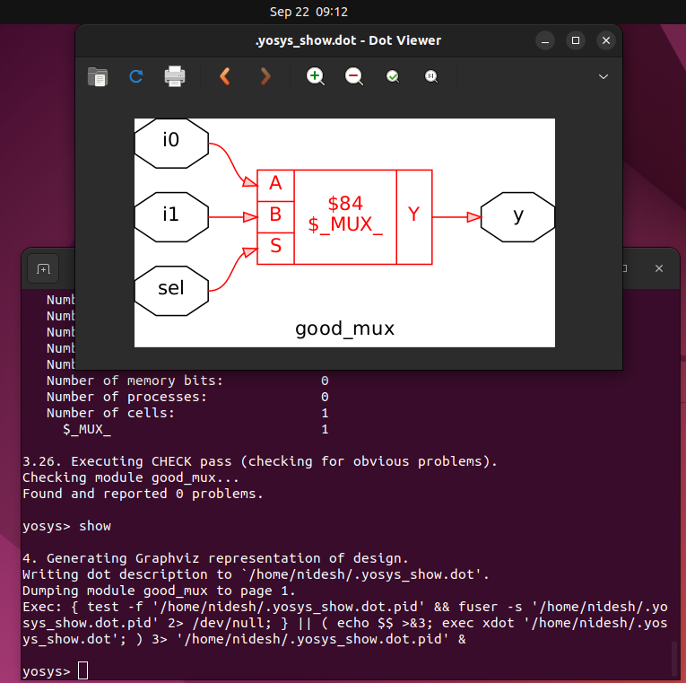
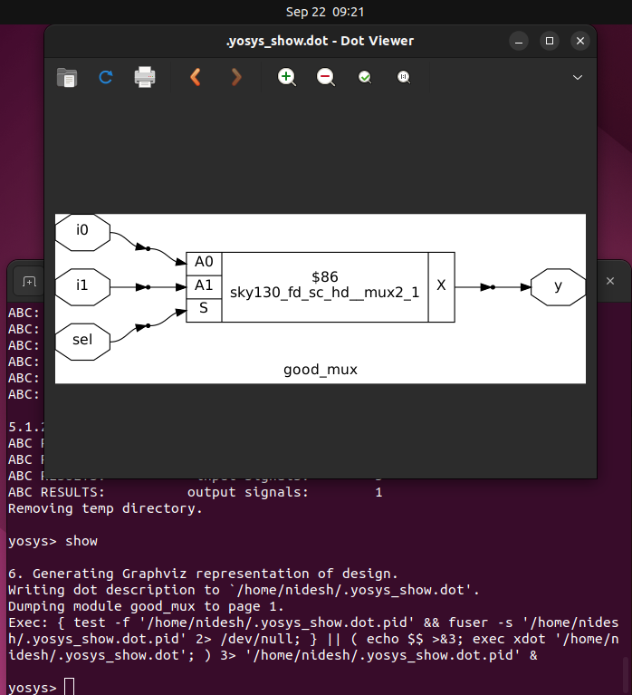

# Day 1 - Introduction to Verilog RTL Design and Synthesis

In this section, we explore the basics of **Verilog simulation** using the open-source tool **Icarus Verilog (iverilog)** and understand the role of **design files** and **testbenches** in RTL design flow.

---

## 🖥️ Simulator
- RTL design is checked for adherence to the specification by **simulating the design**.  
- A **simulator** is the tool used for performing this simulation.  
- In this course, we use **Icarus Verilog (iverilog)** as the simulator.

---

## 📑 Design
- The **design** is the actual Verilog code (or set of codes) which implements the required functionality.  
- The design must meet the **specifications** defined for the hardware.

---

## 🧪 TestBench
- A **testbench** is the setup that applies **stimulus (test vectors)** to the design to verify its functionality.  
- The testbench does not synthesize into hardware; it is only for verification.  

---

## ⚙️ How the Simulator Works
1. The simulator looks for **changes in input signals**.  
2. When an input changes, the corresponding **output is evaluated**.  
3. If there is **no change in the input**, then the output remains the same.  
4. Essentially, the simulator continuously **monitors input changes** to drive the design.  

---

## 📸 Visuals

### 1. Testbench Working
The **testbench setup** consists of:  
- **Stimulus Generator** (applies test vectors to the design)  
- **Design** (implements required logic)  
- **Stimulus Observer** (monitors outputs and verifies correctness)  


---

### 2. Icarus Verilog Design Flow
The Icarus Verilog-based simulation flow consists of:  
- **Design + Testbench** → Compiled by **iverilog**  
- Generates a **VCD (Value Change Dump) file**  
- **GTKWave** reads the VCD file and produces waveform results  


---

## 🔧 Initial Lab Setup

Before starting the labs, we need to set up the working environment and clone the required repository.  

---

### Step 1: Create a working directory
```bash
nidesh@nexus-73:~/Soc/1$ pwd
/home/nidesh/Soc/1
nidesh@nexus-73:~/Soc/1$ mkdir rtl_design_syn_lab
nidesh@nexus-73:~/Soc/1$ ls
rtl_design_syn_lab
nidesh@nexus-73:~/Soc/1$ cd rtl_design_syn_lab/
```

### Step 2: Clone the workshop repository
```bash
git clone https://github.com/kunalg123/sky130RTLDesignAndSynthesisWorkshop.git
cd sky130RTLDesignAndSynthesisWorkshop/
```


Now your folder structure looks like this:
```
sky130RTLDesignAndSynthesisWorkshop/
├── DC_WORKSHOP
├── my_lib
│   ├── lib
│   │   └── sky130_fd_sc_hd__tt_025C_1v80.lib
│   └── verilog_model
├── verilog_files
├── yosys_run.sh
└── README.md
```

### Step 3: Explore the directories

📂 my_lib

Contains all library files required for synthesis.

    Inside lib/ → Standard cell library file:

        sky130_fd_sc_hd__tt_025C_1v80.lib → Timing & power data for standard cells.

    Inside verilog_model/ → All standard cell Verilog models for simulation.

📂 verilog_files

Contains example Verilog designs and their corresponding testbenches.

    Examples include:

        Good/bad cases (good_mux.v, bad_mux.v, etc.)

        Sequential designs (counters, shift registers, FSMs).

        Testbenches (tb_*.v) for verifying each design.

✅ With this setup complete, you are ready to begin the labs using iverilog for simulation and yosys for synthesis in the next steps.


---

### ▶️ Running a Simulation with Icarus Verilog

Here’s the standard flow to run a simulation on a Verilog design and view its output for a example design we have:

### 📂 Example: MUX Design & Testbench
## Design File: good_mux.v

```verilog
module good_mux (input i0, input i1, input sel, output reg y);
  always @(*)
  begin
    if (sel)
      y <= i1;
    else 
      y <= i0;
  end
endmodule
```


## Testbench File: tb_good_mux.v

```verilog
`timescale 1ns/1ps
module tb_good_mux;
  // Inputs
  reg i0, i1, sel;
  // Output
  wire y;

  // Instantiate Unit Under Test (UUT)
  good_mux uut (
    .sel(sel),
    .i0(i0),
    .i1(i1),
    .y(y)
  );

  initial begin
    $dumpfile("tb_good_mux.vcd");  // waveform dump file
    $dumpvars(0, tb_good_mux);     // dump all signals
    // Initialize Inputs
    sel = 0; i0 = 0; i1 = 0;
    #300 $finish;                  // stop simulation
  end

  // Stimulus generators
  always #75 sel = ~sel;
  always #10 i0 = ~i0;
  always #55 i1 = ~i1;
endmodule
```


### Step 1: Navigate to design directory

```bash
cd verilog_files/
```


### Step 2: Compile the Design + Testbench

```bash
iverilog good_mux.v tb_good_mux.v
```


This generates a default simulation executable called a.out.

### Step 3: Run the Simulation

```bash
./a.out
```


This produces a VCD file (tb_good_mux.vcd) as specified in the testbench.

### Step 4: Open the Waveform in GTKWave

```bash
gtkwave tb_good_mux.vcd
```


GTKWave displays the signal transitions over time, letting us visualize and debug the RTL behavior.

### ✅ Simulation Output Flow Recap

- Write Design + Testbench (good_mux.v, tb_good_mux.v)

- Compile with iverilog → generates a.out

- Run simulation → generates tb_good_mux.vcd

- View in GTKWave → waveform analysis


### 👉 Next, we will move from simulation to synthesis using Yosys to generate a gate-level netlist.
---

# 🛠️ Introduction to Yosys and Logic Synthesis

In the RTL design flow, once the functionality of a Verilog design is verified through simulation, the next step is **logic synthesis**.  
This translates the **behavioral RTL code** into a **gate-level netlist** using a standard cell library.  

---

## 🔄 Role of a Synthesizer
- **Synthesizer**: A tool that converts **RTL design** into a **netlist** (collection of gates + interconnections).  
- In this course, we use **Yosys** as the synthesizer.  


---

## 📥 Inputs to the Synthesizer
1. **Design (RTL Verilog code)** – The functionality description written in Verilog.  
2. **Library file (.lib)** – A collection of predefined logic gates (AND, OR, NOT, etc.) with timing, power, and area characteristics.  

---
# 🧩 Part A — Writing Synthesizable RTL

| Aspect | Good Practice ✅ | Avoid ❌ | Example |
| --- | --- | --- | --- |
| **Module & Ports** | Clear names, correct widths | Confusing names, mismatched widths | `verilog<br>module counter(input clk, rst, output [3:0] count);<br>` |
| **Sequential Logic** | `always @(posedge clk or posedge rst)` | Asynchronous delays (`#10`) | `verilog<br>always @(posedge clk or posedge rst)<br> if(rst) count <= 0;<br> else count <= count + 1;<br>` |
| **Combinational** | `always @(*)` | Missing sensitivity list | `verilog<br>always @(*)<br> y = a & b;<br>` |
| **Testbench vs RTL** | Use testbench for `$display`, `#delays` | Putting them inside RTL | `verilog<br>// testbench only<br>initial begin #10 $display("count=%d", count); end<br>` |

---

# 🧩 Part B — What is a `.lib`?

| Feature | Purpose |
| --- | --- |
| **Logic cells** | Defines gates like AND, OR, NOT, FFs, MUX etc. |
| **Flavors (fast/slow)** | Variants of same gate with different speed/power trade-offs. |
| **Characterization** | Includes delay, power, setup/hold times, etc. |
| **Use in Synthesis** | Guides Yosys to map RTL → standard cells → Netlist. |

**Example from `.lib`:**

cell (AND2X1) {
area : 1.2;
pin(A) { direction : input; }
pin(B) { direction : input; }
pin(Y) { direction : output; function : "A & B"; }
}

👉 Meaning: a **2-input AND gate** with defined area, pins, and logic function.

---

⚡ **Key Takeaway:**

- RTL = *Behavioral description* (what the circuit should do).
- `.lib` = *Cell library* (what hardware is available to build it).
- Yosys = *Maps RTL onto `.lib` cells → Netlist*.

---
Next let's infer about the Yosys and the command used here:

**Yosys is an open-source RTL synthesis tool that converts Verilog designs into optimized gate-level netlists using standard cell libraries.**

# 📖 Yosys Command Index

| Command | Purpose | Notes |
| --- | --- | --- |
| `yosys` | Start Yosys interactive shell | Must be run first |
| `read_liberty -lib ../my_lib/lib/sky130_fd_sc_hd__tt_025C_1v80.lib` | Load standard cell library (.lib) | `-lib` treats it as library cells, not design |
| `read_verilog good_mux.v` | Load the Verilog RTL design | Reads your design into Yosys |
| `synth -top good_mux` | Run synthesis | `-top` specifies the top-level module |
| `show` | Visualize design | First `show`: before tech mapping; second `show`: after ABC mapping |
| `abc -liberty ../my_lib/lib/sky130_fd_sc_hd__tt_025C_1v80.lib` | Map design to actual standard cells | Uses ABC optimization & cell mapping |
| `write_verilog good_mux_netlist.v` | Export synthesized netlist (with attributes) | Includes Yosys-specific info |
| `write_verilog -noattr good_mux_netlist.v` | Export clean netlist | Attributes removed → better readability |
| `!vi good_mux_netlist.v` | Inspect netlist in terminal editor | Any editor can be used (`vi`, `nano`, `gedit`) |


# ⚙️ Yosys Command Flow

### 1. Invoke Yosys

```bash
yosys
```

- Check the presence of the .lib file in your system
- Launch the Yosys interactive shell.
  


### 2. Read the Standard Cell Library

```tcl
read_liberty -lib ../my_lib/lib/sky130_fd_sc_hd__tt_025C_1v80.lib
```

- Loads the `.lib` file (timing/power/area data of standard cells).
- `lib` flag tells Yosys to treat it as a **cell library**, not as a design.


### 3. Read the RTL Design

```tcl
read_verilog good_mux.v
```

- Reads your Verilog design file into Yosys.
- At this point, Yosys knows both:
    - **Available cells** (from `.lib`)
    - **Your design logic**


### 4. Run Synthesis

```tcl
synth -top good_mux
```

- Performs RTL-to-gate level conversion.
- `top good_mux` tells Yosys which module is the **top design**.


### 5. Visualize (Pre-ABC)

```tcl
show
```

- Opens a **graphical view** of the synthesized design.
- Still mapped to generic logic (NOT, AND, etc.), not actual `.lib` cells



### 6. Technology Mapping with ABC

```tcl
abc -liberty ../my_lib/lib/sky130_fd_sc_hd__tt_025C_1v80.lib`
```

- Uses **ABC (logic optimization + mapping tool)**.
- Maps your RTL logic into **real standard cells** from the `.lib`.


By observing the ABC results we can infer the presence number of internal signals, input signals and the output signals present matching with the design code


### 7. Visualize (Post-ABC)

```tcl 
show
```

- Now the design is shown as **standard cells** (from `.lib`).



### 8. Write Out the Netlist

```tcl
write_verilog good_mux_netlist.v
```


- Inspect the Netlist

```tcl
!vi good_mux_netlist.v`
```


- Opens the netlist in `vi` editor for manual inspection.

### 9. Exports the **synthesized netlist** with Yosys attributes included.

```tcl
write_verilog -noattr good_mux_netlist.v
!vi good_mux_netlist.v`
```


- Cleaner version → removes Yosys-specific attributes.


✅ **Flow Summary:**

1. Load `.lib` → Load RTL
2. `synth` (generic synthesis)
3. `abc` (map to real cells)
4. `write_verilog` (export netlist)
