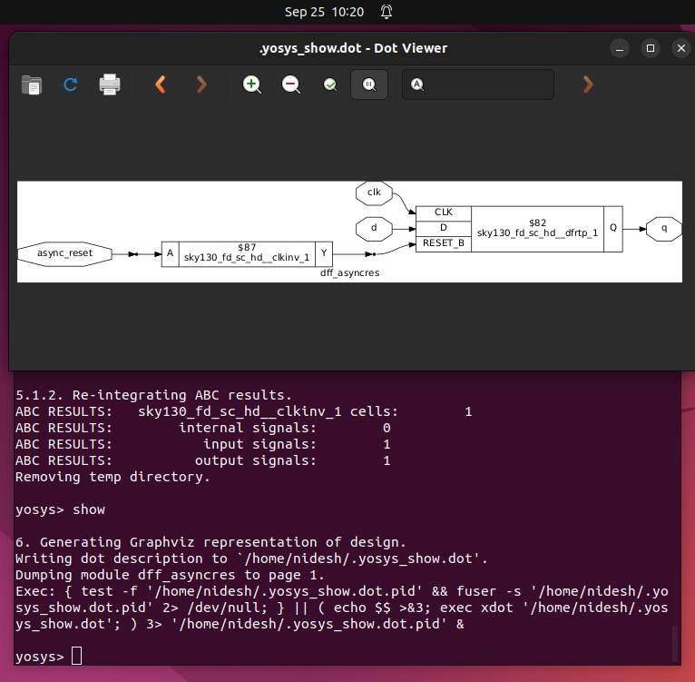

# 📘 Day 2 – Flop Coding Styles & Optimization

In this section, we explore **different types of flip-flops** (async reset, async set, sync reset, and hybrid) through **simulation and synthesis**, and understand how RTL coding style maps into real standard-cell flops in the **Sky130 library**.

---

## 🔹 Part A: Flip-Flop RTL Codes

We start with **four common variants of D flip-flops**:

1. **Asynchronous Reset Flop (`dff_asyncres`)**

```verilog
module dff_asyncres ( input clk ,  input async_reset , input d , output reg q );
always @ (posedge clk , posedge async_reset)
begin
	if(async_reset)
		q <= 1'b0;
	else	
		q <= d;
end
endmodule
```


2. **Asynchronous Set Flop (`dff_async_set`)**

```verilog
module dff_async_set ( input clk ,  input async_set , input d , output reg q );
always @ (posedge clk , posedge async_set)
begin
	if(async_set)
		q <= 1'b1;
	else	
		q <= d;
end
endmodule
```


3. **Synchronous Reset Flop (`dff_syncres`)**

```verilog
module dff_syncres ( input clk , input sync_reset , input d , output reg q );
always @ (posedge clk )
begin
	if (sync_reset)
		q <= 1'b0;
	else	
		q <= d;
end
endmodule
```


4. **Combined Async + Sync Reset Flop (`dff_asyncres_syncres`)**

```verilog
module dff_asyncres_syncres ( input clk , input async_reset , input sync_reset , input d , output reg q );
always @ (posedge clk , posedge async_reset)
begin
	if(async_reset)
		q <= 1'b0;
	else if (sync_reset)
		q <= 1'b0;
	else	
		q <= d;
end
endmodule
```


## 🔹 Part B: Simulation Flow

We simulate each variant using **Icarus Verilog** (`iverilog`) and view waveforms in **GTKWave**.

---

### 1. **Async Reset Flop (dff_asyncres)**

**Testbench (`tb_dff_asyncres.v`)**

```verilog
`timescale 1ns / 1ps
module tb_dff_asyncres;
	reg clk, async_reset, d;
	wire q;

	dff_asyncres uut (.clk(clk), .async_reset(async_reset), .d(d), .q(q));

	initial begin
		$dumpfile("tb_dff_asyncres.vcd");
		$dumpvars(0,tb_dff_asyncres);
		clk = 0; async_reset = 1; d = 0;
		#3000 $finish;
	end

	always #10 clk = ~clk;
	always #23 d = ~d;
	always #547 async_reset = ~async_reset;
endmodule
```

**Commands:**

```bash
iverilog dff_asyncres.v tb_dff_asyncres.v
./a.out
gtkwave tb_dff_asyncres.vcd
```


**Waveform Characteristics:**

- On any `async_reset=1`, `q` → `0` **immediately**, ignoring the clock.
- When reset=0, `q` follows `d` at rising edges of `clk`.
- Shows **asynchronous dominance**.

---

### 2. **Async Set Flop (dff_async_set)**

**Testbench (`tb_dff_async_set.v`)**

```verilog
`timescale 1ns / 1ps
module tb_dff_async_set;
	reg clk, async_set, d;
	wire q;

	dff_async_set uut (.clk(clk), .async_set(async_set), .d(d), .q(q));

	initial begin
		$dumpfile("tb_dff_async_set.vcd");
		$dumpvars(0,tb_dff_async_set);
		clk = 0; async_set = 1; d = 0;
		#3000 $finish;
	end

	always #10 clk = ~clk;
	always #23 d = ~d;
	always #547 async_set = ~async_set;
endmodule

```

**Commands:**

```bash
iverilog dff_async_set.v tb_dff_async_set.v
./a.out
gtkwave tb_dff_async_set.vcd

```


**Waveform Characteristics:**

- On any `async_set=1`, `q` → `1` immediately.
- When set=0, `q` tracks `d` at rising edges of `clk`.
- Used rarely, but demonstrates **async set functionality**.

---

### 3. **Sync Reset Flop (dff_syncres)**

**Testbench (`tb_dff_syncres.v`)**

```verilog
`timescale 1ns / 1ps
module tb_dff_syncres;
	reg clk, sync_reset, d;
	wire q;

	dff_syncres uut (.clk(clk), .sync_reset(sync_reset), .d(d), .q(q));

	initial begin
		$dumpfile("tb_dff_syncres.vcd");
		$dumpvars(0,tb_dff_syncres);
		clk = 0; sync_reset = 0; d = 0;
		#3000 $finish;
	end

	always #10 clk = ~clk;
	always #23 d = ~d;
	always #113 sync_reset = ~sync_reset;
endmodule
```

**Commands:**

```bash
iverilog dff_syncres.v tb_dff_syncres.v
./a.out
gtkwave tb_dff_syncres.vcd
```


**Waveform Characteristics:**

- Reset works **only at clock edge**.
- If `sync_reset=1` at posedge, `q=0`; else `q=d`.
- Safer for synchronous systems, avoids glitches.

---

## 🔹 Part C: Synthesis Flow

We now map the flops into **Sky130 Std Cells** using **Yosys**.

**Commands:**

```bash
# Load library
read_liberty -lib ../my_lib/lib/sky130_fd_sc_hd__tt_025C_1v80.lib 

# Async Reset Flop
read_verilog dff_asyncres.v 
synth -top dff_asyncres 
dfflibmap -liberty ../my_lib/lib/sky130_fd_sc_hd__tt_025C_1v80.lib 
abc -liberty ../my_lib/lib/sky130_fd_sc_hd__tt_025C_1v80.lib 
show

# Async Set Flop
read_verilog dff_async_set.v 
synth -top dff_async_set 
dfflibmap -liberty ../my_lib/lib/sky130_fd_sc_hd__tt_025C_1v80.lib 
abc -liberty ../my_lib/lib/sky130_fd_sc_hd__tt_025C_1v80.lib 
show

# Sync Reset Flop
read_verilog dff_syncres.v 
synth -top dff_syncres 
dfflibmap -liberty ../my_lib/lib/sky130_fd_sc_hd__tt_025C_1v80.lib 
abc -liberty ../my_lib/lib/sky130_fd_sc_hd__tt_025C_1v80.lib 
show
```

### **Synthesis Observations**

1. **Async Reset Flop**
    - Sky130 has **active-low reset DFFs**.
    - Since RTL used active-high reset, Yosys adds an **inverter** on `async_reset`.

    

2. **Async Set Flop**
    - If no direct async-set flop exists, tool builds it with **inverters + reset-like logic**.
    - Functionally equivalent, but not as efficient.

   

3. **Sync Reset Flop**
    - RTL is equivalent to:q=sync_reset⋅d
      <p allign = "center"
        q = ~(sync_reset)⋅dq
		  </p>
    - Yosys maps it as:
        - A **plain DFF (no reset pin)**.
        - An **AND gate** before `D`, one input inverted `sync_reset`, another `d`.

   

### 🔹 Final Summary

| Flop Type | Reset/Set Behavior | Waveform Trait | Synthesis Mapping |
| --- | --- | --- | --- |
| Async Reset | Immediate reset → 0 | Drops to 0 anytime reset=1 | DFF with active-low reset + inverter |
| Async Set | Immediate set → 1 | Jumps to 1 anytime set=1 | DFF with logic mapping for set |
| Sync Reset | Reset only at clk | Reset visible only at posedge | DFF + AND gate with inverted reset |
| Async+Sync Reset | Hybrid behavior | Async dominates, sync follows | Mix of above |


# 🔹 Special Case Optimizations in Synthesis

Not all arithmetic operations require heavy logic like multipliers or adders.

For certain **special cases**, synthesis tools apply **smart optimizations** that drastically reduce hardware.

Let’s explore two cases: **multiplication by powers of 2** and **multiplication by constants like 9**.

---

## 1️⃣ Multiplication by Powers of 2 → Bit-Shift Optimization

### Example: `mult_2.v`

```verilog
module mul2 (input [2:0] a, output [3:0] y);
assign y = a * 2;
endmodule
```


Here `a` is a 3-bit input, and `y` is a 4-bit output.

Instead of implementing a **full multiplier circuit**, the synthesizer realizes:
<p align="center">
   y = a×2 = a<<1
</p>
     
That means:  **append one zero at the LSB.**

### Truth Table (3-bit `a` → 4-bit `y`)

| `a[2:0]` (Decimal) | Binary `a` | `y = a*2` (Decimal) | Binary `y` |
| --- | --- | --- | --- |
| 0 | 000 | 0 | 0000 |
| 1 | 001 | 2 | 0010 |
| 2 | 010 | 4 | 0100 |
| 3 | 011 | 6 | 0110 |
| 4 | 100 | 8 | 1000 |
| 5 | 101 | 10 | 1010 |
| 6 | 110 | 12 | 1100 |
| 7 | 111 | 14 | 1110 |

🔹 Notice: The result is just `a` shifted left by 1, i.e., **{a, 0}**.

### Yosys Synthesis Output

```verilog
module mul2(a, y);
  input [2:0] a;
  output [3:0] y;
  assign y = { a, 1'b0 };
endmodule
```


✅ Instead of a multiplier, the tool optimizes it into a simple **concatenation**: append one `0`.

---

### General Rule

- Multiply by 2 → append 1 zero (`a << 1`)
- Multiply by 4 → append 2 zeros (`a << 2`)
- Multiply by 8 → append 3 zeros (`a << 3`)

🔹 This is extremely area- and power-efficient compared to a real multiplier.

---

## 2️⃣ Multiplication by Non-Power Constant → Smart Decomposition

### Example: `mult_8.v`

```verilog
module mult8 (input [2:0] a , output [5:0] y);
assign y = a * 9;
endmodule
```


Here `y = a × 9`.

But instead of directly implementing multiplication, the tool rewrites:

<p align="center">
a×9 = a×(8+1) = (a<<3)+a
                </p>
So synthesis tool detects this and **replicates `a` cleverly.**

---

### Yosys Optimized Output

```verilog
module mult8(a, y);
  input [2:0] a;
  output [5:0] y;
  assign y = { a, a };
endmodule
```


✅ Instead of a multiplier, it concatenates `a` twice: **{a, a}**.

This is equivalent to `(a << 3) + a`.

---

## 🔹 Why These Optimizations Matter

- **Reduced Area** → No multiplier hardware, just wiring or small adders.
- **Lower Power** → Multipliers consume much more power; shifts and concatenations are cheap.
- **Faster Timing** → Shift and wire-based operations are faster than multiplier delay paths.
- **Customizable** → Synthesis tools allow such optimizations for constants in datapaths.

---

## 📌 Summary Table

| Case | RTL Expression | Synthesized Form | Hardware Used |
| --- | --- | --- | --- |
| Multiply by 2 | `y = a*2` | `y = {a, 0}` | Shift left by 1 |
| Multiply by 4 | `y = a*4` | `y = {a, 00}` | Shift left by 2 |
| Multiply by 8 | `y = a*8` | `y = {a, 000}` | Shift left by 3 |
| Multiply by 9 | `y = a*9` | `y = {a, a}` | Concatenate + Add |

🚀 This demonstrates how synthesis is not just mapping RTL → gates,

but also **understands arithmetic patterns** and optimizes for hardware efficiency.

---

## 🏁 Conclusion of Day 2: Special Case Optimizations

In this session, we explored **special case multipliers** and how synthesis tools like **Yosys** detect and optimize them:

- Multiplication by powers of two (`2`, `4`, `8`) gets transformed into **bit-shift operations** by appending zeros.
- Multiplication by numbers like `9` (`a * 9`) is broken down into `a * (8+1) = (a << 3) + a`, which simplifies into **concatenation-based structures** (e.g., `{a, a}`).
- These optimizations reduce the hardware footprint to **zero additional gates**, since they can be implemented using **wiring and concatenation only**.

This highlights the **strength of synthesis tools** in recognizing mathematical patterns and reducing logic complexity without manual intervention. Such optimizations ensure that the design is not only correct but also highly **area- and power-efficient**.

---

## 🔜 Moving to Day 3: Combinational and Sequential Optimizations

Now that we’ve seen **structural optimizations for arithmetic operations**, the next step is to dive deeper into:

- **Combinational Optimizations** – Boolean algebra simplifications, constant propagation, redundant logic removal.
- **Sequential Optimizations** – Register balancing, retiming, redundant flop removal, and optimizations across clock boundaries.

These techniques allow us to push designs further toward **timing closure, area reduction, and power savings**.

👉 **Let’s begin  with Combinational Optimizations.** 🚀

---
