# Day 2 – Timing Libraries, Synthesis Approaches & Flip-Flop Coding Styles

Welcome to **Day 2** of the RISC-V SoC Tapeout Program (Week 1).

📌 **Quick Recap of :**

We explored Verilog RTL design, created testbenches, ran simulations using **Icarus Verilog (iverilog)**, and performed basic synthesis with **Yosys**. We also learned how simulators detect input changes and how design + testbench flows into simulation.

---

## What’s New in Day 2?

Today, we move closer to **real-world SoC design flows** by diving into three critical aspects:

- **Timing Libraries (`.lib`)** → What they are, how to read them, and the naming conventions used.
- **Hierarchical vs. Flat Synthesis** → Different strategies for synthesizing complex designs.
- **Flip-Flop Coding Styles & Optimizations** → Writing sequential logic in multiple ways and observing synthesis optimizations.

👉 This day builds the bridge between **basic RTL design** (Day 1) and **technology-aware synthesis** (Day 2 onwards).

---

# 🕒 Timing Libraries: An Overview

When we move from **RTL design** (abstract Verilog) to **real silicon**, the tools need to know how logic gates behave in terms of **timing, power, and area**. This knowledge comes from the **Standard Cell Library**, captured in a `.lib` file.

---

## ❓ 1. What is a `.lib` file?

A **`.lib` (Liberty file)** is a text-based file provided by the **foundry** or **PDK vendor**. It describes the properties of each **standard cell** used in synthesis and implementation.

### 🧩 Key Contents of a `.lib`:

- **Logical View** – Function of the gate (e.g., NAND, NOR, DFF).
- **Timing Information** – Propagation delay, setup time, hold time, clock-to-Q, etc.
- **Power Data** – Leakage power, dynamic (switching) power.
- **Area Information** – Gate size in silicon.
- **Operating Conditions** – Values across PVT (Process, Voltage, Temperature) corners.
- **Cell Variants (Flavors)** – Same function, different speed/power trade-offs.

📌 *Example:* `sky130_fd_sc_hd__and2_0`

- `and2` → 2-input AND gate
- `_0` → Small, slow variant (low power, small area)
- `_2` → Medium drive strength
- `_4` → Strong, fast variant (high power, more area)

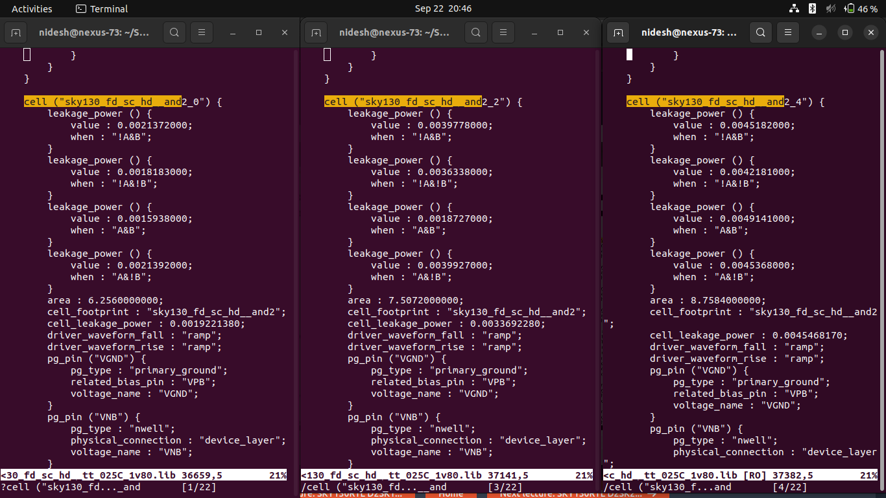

---

## ❓ 2. Why do we need `.lib` files?

Without timing libraries, synthesis would be like designing circuits with **imaginary gates**—no real-world behavior.

**Reasons for `.lib` files:**

1. **Technology Awareness** – RTL mapped to real gates of the PDK.
2. **Performance Control** – Enables use of *fast cells* where speed is critical.
3. **Power Efficiency** – Enables use of *slow cells* where speed isn’t critical.
4. **Flavors for Trade-offs** – Helps balance speed, power, and area.
5. **Multi-Corner Analysis** – Accounts for process variation, supply fluctuations, and temperature.
6. **Consistency Across Flow** – Used by:
    - **Synthesis (Yosys)** → Gate-level mapping
    - **STA (OpenSTA)** → Timing closure
    - **PnR (OpenROAD)** → Placement, routing decisions

---

## ❓ 3. How are `.lib` files made?

`.lib` files are generated through **Library Characterization**:

1. **Transistor-Level Simulation**
    - Each standard cell (NAND, NOR, DFF, etc.) is simulated using **SPICE**.
2. **Extract Metrics**
    - Delays, setup/hold, leakage, switching power, etc., are measured.
3. **PVT Characterization**
    - Data is captured across multiple:
        - **Process corners** (Slow, Typical, Fast → SS, TT, FF)
        - **Voltage levels** (e.g., 1.62 V, 1.8 V, 1.98 V)
        - **Temperature points** (e.g., -40°C, 25°C, 125°C)
4. **Create Variants (Flavors)**
    - By changing transistor width:
        - Wider → Faster, higher drive, more area/power
        - Narrower → Slower, less drive, more efficient
5. **Naming Convention**
    - Prefix → Tech & library (e.g., `sky130_fd_sc_hd`)
    - Cell → Function (`and2`, `dff`, `mux`)
    - Suffix → Drive strength (`_0`, `_2`, `_4`)

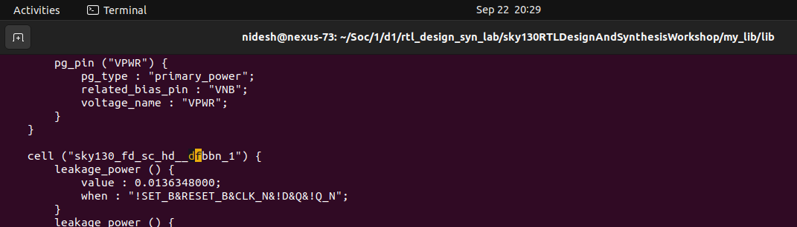

---

## ⚡ Fast vs. Slow Cells — Comparison

| Feature | Fast Cells 🚀 | Slow Cells 🐢 |
| --- | --- | --- |
| **Delay** | Very low (fast switching) | Higher (slower switching) |
| **Area** | Larger (wide transistors) | Smaller (narrow transistors) |
| **Power** | High dynamic + leakage | Low dynamic + leakage |
| **Usage** | Critical paths (reduce delay) | Non-critical paths (save power/area) |
| **Hold Timing** | Can cause violations | Helps fix violations |
| **Performance Impact** | Improves max frequency | May limit frequency |
| **Cost Trade-off** | Speed at expense of power/area | Efficiency at expense of speed |

---

## 📝 Wrap-up

- `.lib` = Dictionary of standard cells with timing, power, and area data.
- Needed for **accurate synthesis, STA, and PnR**.
- Built using **SPICE characterization** across **PVT corners**.
- Provides **cell flavors** to balance **performance vs. efficiency**. 

# 📂 Current Setup of Liberty & Models 

Your working directory contains:

```
my_lib/
 ├── lib/
 │   └── sky130_fd_sc_hd__tt_025C_1v80.lib
 └── verilog_model/
     ├── primitives.v
     └── sky130_fd_sc_hd.v
```

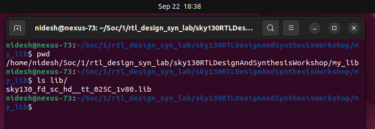

## 🔹 1. What these files contain

| File | Purpose | Content Summary |
| --- | --- | --- |
| `sky130_fd_sc_hd__tt_025C_1v80.lib` | **Liberty Timing Library** | Characterized timing, power, and area data for **Sky130 HD cells** at **TT, 25°C, 1.8V**. Contains cell definitions (`and2`, `mux`, `dff`, etc.), timing arcs, leakage, capacitance, PVT operating conditions. |
| `sky130_fd_sc_hd.v` | **Functional Verilog Model** | Defines **behavioral logic** of each standard cell in Verilog. Used during simulation (gate-level sim) to mimic functionality. Includes module ports (A, B, X, VPWR, VGND, VPB, VNB). |
| `primitives.v` | **Primitive Definitions** | Low-level building blocks (e.g., basic logic primitives, bufif, notif). Helps simulators understand how composite cells are formed. |

⚡ Key:

- `.lib` = **timing & electrical view**
- `.v` = **functional/structural view**

---

## 🔹 2. Breakdown of `sky130_fd_sc_hd__tt_025C_1v80.lib` filename

| Section | Meaning |
| --- | --- |
| `sky130` | Process node: SkyWater **130nm** |
| `fd` | **Foundry Design** kit prefix |
| `sc` | **Standard Cells** |
| `hd` | **High Density** library variant (optimized for area, lower power) |
| `tt` | **Typical Process Corner** (balanced NMOS/PMOS) |
| `025C` | **Temperature = 25°C** |
| `1v80` | **Voltage = 1.8 V nominal** |

So → This file describes **Sky130 High-Density cells** under **TT, 25°C, 1.8V** conditions.

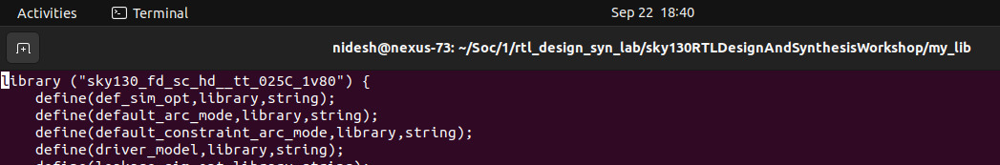

## 🔹 3. Example of `.lib` global definitions

From the beginning of your file:

| Parameter | Example Value | Meaning |
| --- | --- | --- |
| `library ("sky130_fd_sc_hd__tt_025C_1v80")` | — | Defines the library name |
| `delay_model` | `table_lookup` | Delays are stored as tables (vs equations) |
| `bus_naming_style` | `%s[%d]` | How buses are named (e.g., A[0], A[1]) |
| `time_unit` | `1ns` | All timing values in nanoseconds |
| `voltage_unit` | `1V` | Voltage scaling unit |
| `current_unit` | `1mA` | Current scaling unit |
| `capacitive_load_unit` | `1.0 pf` | Default unit for capacitance |
| `default_max_transition` | `1.5 ns` | Max allowed transition at outputs |
| `default_operating_conditions` | `tt_025C_1v80` | PVT corner |
| `operating_conditions {}` | 1.8V, 25°C, process=1.0 | Specifies PVT environment for this library |

📌 These defaults are **applied to every cell** inside the library unless overridden.

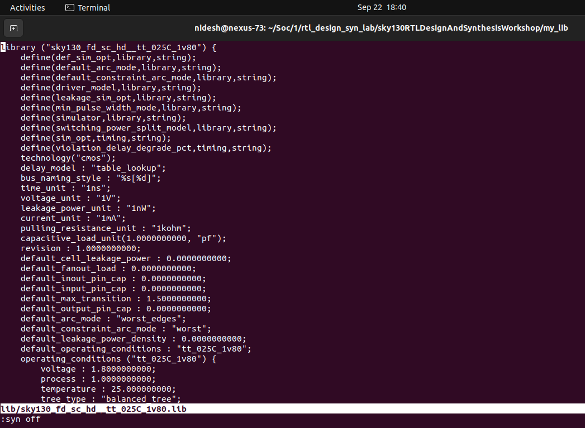

## 🔹 4. Example Cell — AND gate

### Liberty View (`sky130_fd_sc_hd__tt_025C_1v80.lib`)

```
cell ("sky130_fd_sc_hd__and2_1") {
    leakage_power() { value: 0.0031719; when: "!A&B"; }
    leakage_power() { value: 0.0028440; when: "!A&!B"; }
    leakage_power() { value: 0.0014741; when: "A&B"; }
    leakage_power() { value: 0.0031700; when: "A&!B"; }

    area: 6.256; 
    cell_footprint: "sky130_fd_sc_hd__and2"; 
    cell_leakage_power: 0.0026650;

    pg_pin("VGND") { pg_type: "primary_ground"; related_bias_pin: "VPB"; voltage_name: "VGND"; }
}
```

| Field | Meaning |
| --- | --- |
| `cell("sky130_fd_sc_hd__and2_1")` | Cell name = 2-input AND, drive strength `_1` |
| `leakage_power {when: "!A&B"}` | Leakage depends on input state (here A=0, B=1) |
| `area: 6.256` | Cell occupies 6.256 µm² |
| `cell_footprint` | Base logical function (family of and2 cells) |
| `cell_leakage_power` | Total average leakage |
| `pg_pin("VGND")` | Power/ground pin description |

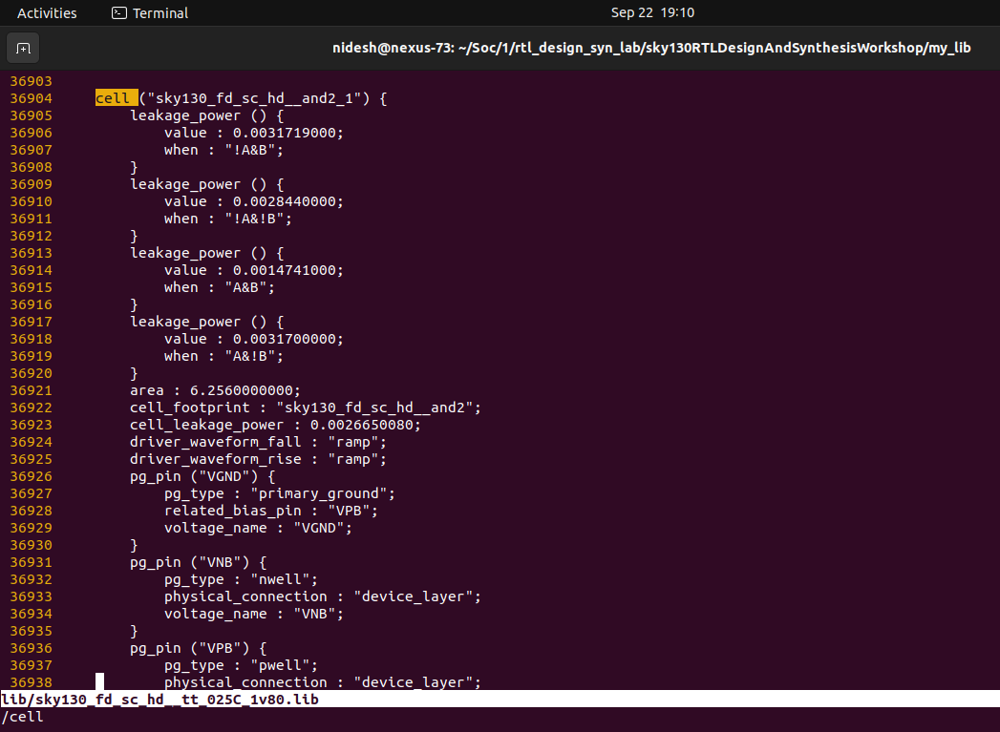

---
Verilog View (`sky130_fd_sc_hd.v`)

```
module sky130_fd_sc_hd__and2_1 (
    X,
    A,
    B,
    VPWR,
    VGND,
    VPB,
    VNB
);
    output X;
    input A, B;
    input VPWR, VGND, VPB, VNB;

    sky130_fd_sc_hd__and2 base (
        .X(X), .A(A), .B(B),
        .VPWR(VPWR), .VGND(VGND),
        .VPB(VPB), .VNB(VNB)
    );
endmodule
`endcelldefine
```

| Field | Meaning |
| --- | --- |
| `module sky130_fd_sc_hd__and2_1` | Verilog model for AND2 with drive strength `_1` |
| Ports: `A, B, X` | Functional pins (2 inputs, 1 output) |
| Ports: `VPWR, VGND, VPB, VNB` | Power, ground, body-bias connections |
| `sky130_fd_sc_hd__and2 base` | Instantiates the primitive functional block |

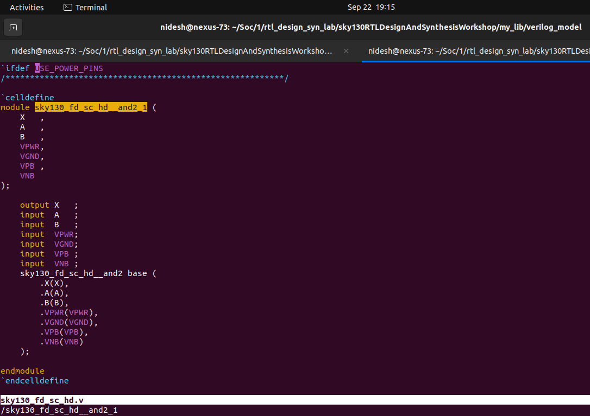

## ✨ Key Takeaways

- `.lib` file = **timing/power/area data** for synthesis & STA.
- `.v` file = **functional model** for simulation.
- `sky130_fd_sc_hd__tt_025C_1v80.lib` = Sky130 High Density library @ **TT, 25°C, 1.8V**.
- AND2 example shows how the same cell has **two views**:
    - `.lib`: electrical behavior (delays, leakage, area).
    - `.v`: logical/functional behavior (input/output connections).

---

# 🧪 **Day 2 – Lab on Hierarchical & Flat Synthesis (multiple_modules.v)**

### 🎯 **Objective**

To understand how **hierarchical synthesis** works in Yosys by synthesizing a multi-module design (`multiple_modules.v`) and preserving the hierarchy in the synthesized netlist.

---

# 🟢 Hierarchical Synthesis in Yosys

### 📂 **Step 1 – Design Setup**

We start with the Verilog design file:

```
module sub_module2 (input a, input b, output y);
  assign y = a | b;
endmodule

module sub_module1 (input a, input b, output y);
  assign y = a & b;
endmodule

module multiple_modules (input a, input b, input c, output y);
  wire net1;
  sub_module1 u1(.a(a), .b(b), .y(net1)); // net1 = a & b
  sub_module2 u2(.a(net1), .b(c), .y(y)); // y = net1 | c = (a & b) | c
endmodule
```

🔎 **Logic function:**

<p align="center">
  y = (a · b) + c
</p>

So, the top-level module (`multiple_modules`) is composed of two submodules:

- `sub_module1` → AND gate
- `sub_module2` → OR gate

---

### ⚙️ **Step 2 – Yosys Commands**

We run synthesis with Sky130 standard cell library:

```
read_liberty -lib ../my_lib/lib/sky130_fd_sc_hd__tt_025C_1v80.lib
read_verilog multiple_modules.v
synth -top multiple_modules
abc -liberty ../my_lib/lib/sky130_fd_sc_hd__tt_025C_1v80.lib
show multiple_modules
write_verilog multiple_modules_hier.v
```

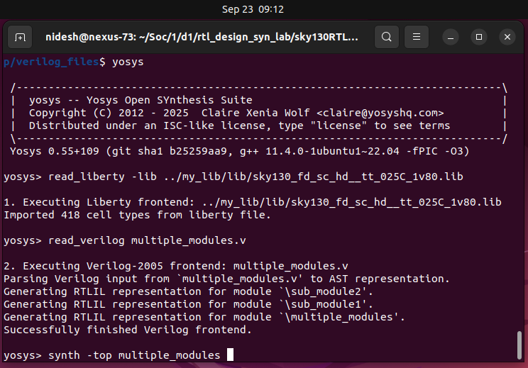

- **read_liberty** → Reads the technology library (`.lib`).
- **read_verilog** → Reads our RTL design.
- **synth -top** → Synthesizes top module (`multiple_modules`).
- **abc -liberty** → Maps RTL logic to **Sky130 standard cells**.
- **show** → Displays schematic of synthesized design.
- **write_verilog** → Writes out the synthesized gate-level netlist.

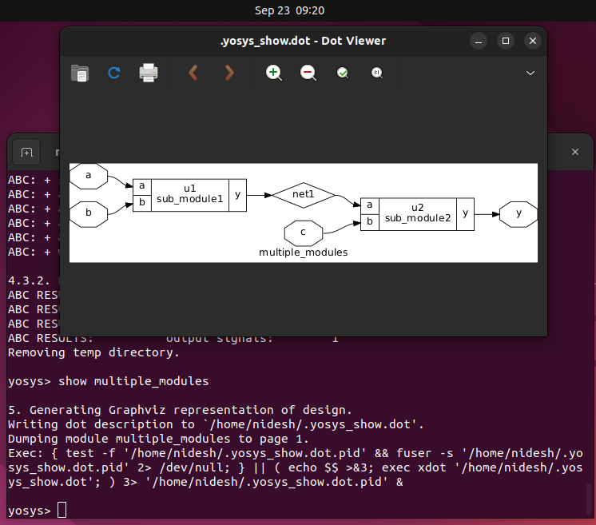

---

### 📜 **Step 3 – Synthesized Hierarchical Netlist**

The generated file `multiple_modules_hier.v` shows:

### **Top-level preserved** (`multiple_modules`):

```
module multiple_modules(a, b, c, y);
  wire net1;
  sub_module1 u1 (.a(a), .b(b), .y(net1));
  sub_module2 u2 (.a(net1), .b(c), .y(y));
endmodule
```
# Synthesized Result:

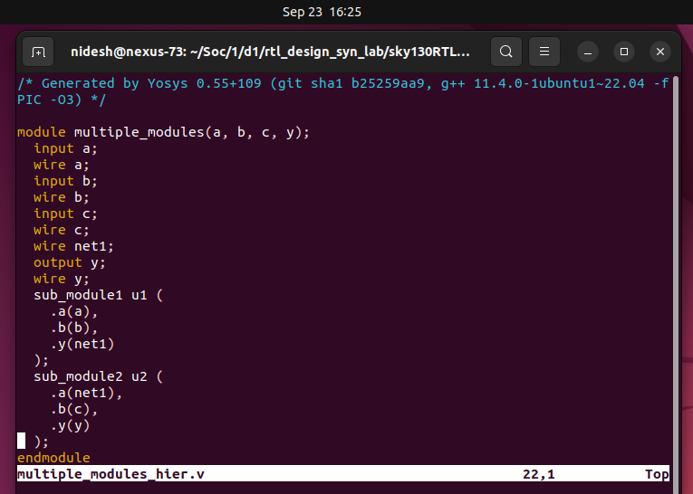

👉 The hierarchy is maintained → `sub_module1` and `sub_module2` exist separately.

**sub_module1 mapped to cells:**

```
module sub_module1(a, b, y);
  sky130_fd_sc_hd__and2_0 _3_ (.A(b), .B(a), .X(y));
endmodule
```
# Synthesized Result:

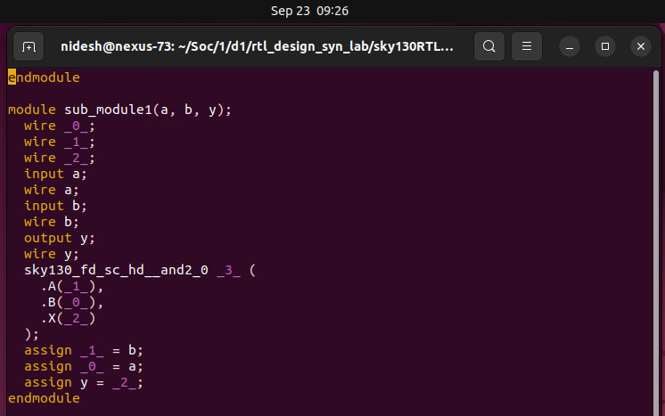

**sub_module2 mapped to cells:**

```
module sub_module2(a, b, y);
  sky130_fd_sc_hd__or2_0 _3_ (.A(b), .B(a), .X(y));
endmodule
```
# Synthesized Result:

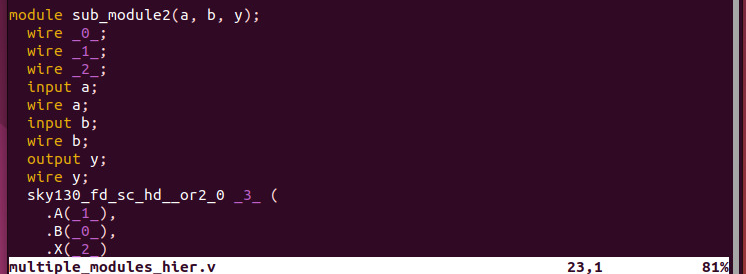

So,

- `sub_module1` → implemented using `sky130_fd_sc_hd__and2_0` (2-input AND gate).
- `sub_module2` → implemented using `sky130_fd_sc_hd__or2_0` (2-input OR gate).

---

### 📝 **Analysis**

- The **hierarchy is preserved** (submodules are still present in netlist).
- Each submodule is individually mapped to **standard cells** from Sky130 library.
- This makes **debugging easy** since `multiple_modules` → `sub_module1` + `sub_module2` are still visible.
- If we had **flattened synthesis**, the tool would directly map the entire `(a&b)|c` logic into one flat netlist (losing submodules).

---

### ✅ **Conclusion**

- We successfully performed **hierarchical synthesis** in Yosys.
- The **Sky130 standard cells** were used for logic mapping.
- The preserved hierarchy shows how **RTL modules translate** into gate-level submodules, each made up of real technology cells.

---

⚡ Next step: we can do the **Flat synthesis lab** using the same design (`flatten` in Yosys) and compare both styles.

---
# 🟢 Flat Synthesis in Yosys

## 🔹 What We Did

Unlike **hierarchical synthesis** (which preserves submodules), in **flat synthesis** we collapse the entire design into a **single module**.

This means all logic from submodules is absorbed into the top module during synthesis, eliminating hierarchy.

---

## 🔹 Commands Used

| Command | Purpose |
| --- | --- |
| `read_liberty -lib ../my_lib/lib/sky130_fd_sc_hd__tt_025C_1v80.lib` | Load timing/power models of standard cells |
| `read_verilog multiple_modules.v` | Load the RTL design with hierarchy |
| `synth -top multiple_modules` | Run synthesis with `multiple_modules` as the top |
| `abc -liberty ../my_lib/lib/sky130_fd_sc_hd__tt_025C_1v80.lib` | Technology mapping (map RTL → std cells) |
| `flatten` | **Flattens hierarchy**: submodules merged into one netlist |
| `show` | Visualize schematic after flattening |
| `write_verilog -noattr multiple_modules_flat.v` | Write final flat netlist (clean) |

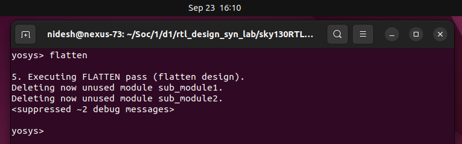

### Visualization:

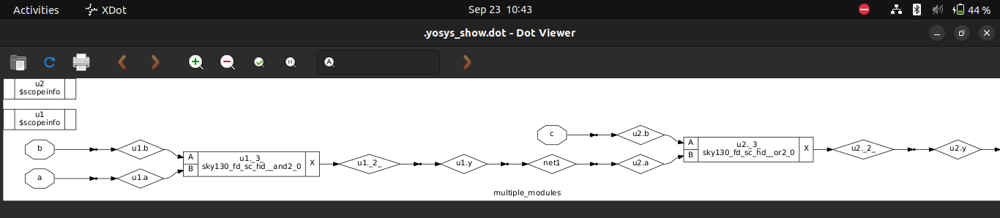


## 🔹 Output Observed

Generated **flat netlist** → `multiple_modules_flat.v`

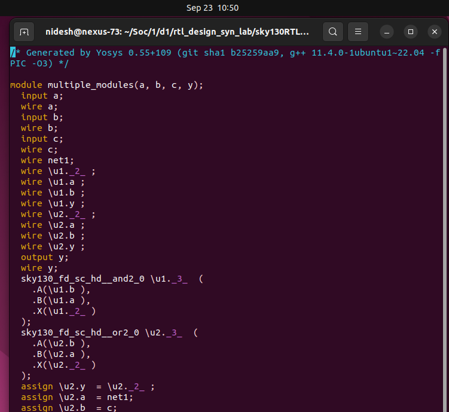

### Key Observations:

- Only **one module** exists: `multiple_modules`
- Submodules (`sub_module1`, `sub_module2`) no longer exist — their logic is inlined.
- Standard cells (`sky130_fd_sc_hd__and2_0`, `sky130_fd_sc_hd__or2_0`) appear **directly in the top module**.
- Internal nets and signals are renamed (like `\u1.*2*`, `\u2.*3*`) to preserve uniqueness.

---

## 🔹 Visual Difference

**Hierarchical Netlist**

```
multiple_modules
 ├── sub_module1 → mapped to AND gate
 └── sub_module2 → mapped to OR gate
```

**Flat Netlist**

```
multiple_modules
 ├── AND gate (directly inside top)
 └── OR gate (directly inside top)
```

---

## 🔹 Why Flat Synthesis?

- Easier for **place-and-route tools** (no module boundaries).
- Optimizations can cross module boundaries (better timing/area).
- But: readability is reduced, debugging is harder.

---

✅ With this, you now have **both hierarchical and flat netlists** for the same RTL design, showing the trade-offs.

---

# 🟢 Submodule Synthesis in Yosys

## 🔹 What We Did

Instead of synthesizing the **top module (`multiple_modules`)**, we directly synthesized a **submodule (`sub_module1`)**.

### Commands

```
read_liberty -lib ../my_lib/lib/sky130_fd_sc_hd__tt_025C_1v80.lib 
read_verilog multiple_modules.v 
synth -top sub_module1
abc -liberty ../my_lib/lib/sky130_fd_sc_hd__tt_025C_1v80.lib 
show
```

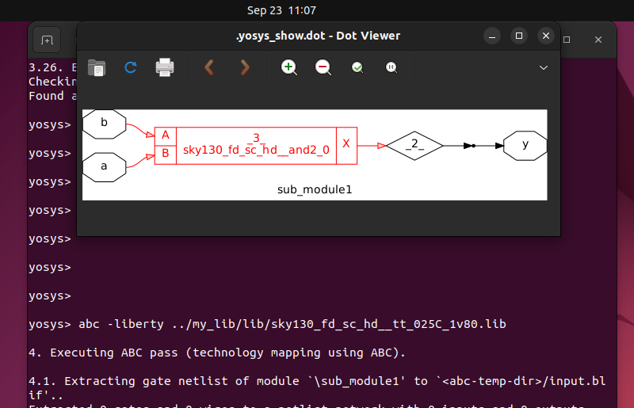

---

## 🔹 Why Submodule Synthesis?

1. **Multiple Instances Optimization**
    - If a submodule is instantiated many times, synthesizing it once helps us reuse its optimized netlist everywhere.
    - Saves synthesis time and ensures **consistent logic** across all instances.
2. **Divide-and-Conquer Approach**
    - Large SoCs are too big to synthesize in one shot.
    - We break the design into smaller blocks (submodules), synthesize independently, then integrate at higher levels.
    - Improves **scalability, modularity, and debug**.

---

## 🔹 Example

If `sub_module1` = AND gate:

- Synthesizing it alone shows how Yosys maps it directly to `sky130_fd_sc_hd__and2_*` standard cell.
- Then, in higher-level designs, this optimized submodule can be reused multiple times.

---

# 📊 Summary Table – Hierarchical vs Flat Synthesis

| Aspect | Hierarchical Synthesis | Flat Synthesis |
| --- | --- | --- |
| **Structure** | Preserves submodules | Merges all logic into a single module |
| **Readability** | Easy to trace RTL hierarchy | Harder to debug (all logic mixed) |
| **Reuse** | Submodules can be reused (efficient for multiple instances) | No reuse — each instance fully expanded |
| **Optimization** | Limited across module boundaries | Global optimization across the whole design |
| **Synthesis Time** | Faster for incremental or block-level synthesis | Slower for large designs |
| **Use Case** | Good for modular designs, IP reuse, debugging | Preferred for final PnR, better performance/area |

✅ With **Hierarchical, Flat, and Submodule Synthesis**, you now see all three ways Yosys handles designs.

---

# Intro to Flops

## 1. What is a Flop?

- A **flip-flop (flop)** is a **sequential storage element**.
- Unlike combinational circuits, whose outputs change continuously based on inputs, a flop holds a value and updates **only on a clock edge**.
- Think of it as a **memory element** that “shields” downstream logic from glitches.

---

## 2. Why Do We Need Flops?

Let’s start with a combinational circuit example:

<p align="center">
  y = (a · b) + c
</p>

- Inputs: `a`, `b`, and `c`.
- `a & b → net1`, then `net1 | c → y`.

### ⚡ Propagation Delay & Glitches

- Every gate has a **propagation delay (tpd)**.
- If inputs change at slightly different times, the output can momentarily glitch.

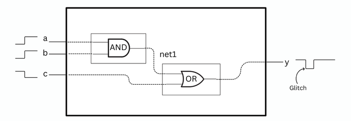

**Case study:**

1. Initially, `a=0, b=0, c=1 → y=1`.
2. At time `t=0`: `a=1, b=1, c=0` (all switch “simultaneously”).
3. OR gate reacts to `c=0` first (1 ns delay) → `y` goes low.
4. AND gate takes longer (2 ns delay) → `net1` becomes 1 at `t=2ns`.
5. That new `net1=1` still needs 1 ns through OR gate → `y` goes high again at `t=3ns`.
6. Result: **Glitch on y** between 0–3 ns.

➡️ As the depth of combinational logic grows, **glitches increase**. Outputs may **never settle cleanly**.

---

## 3. The Role of Flops

- To solve this, we place **flops between combinational blocks**.
- Flops **store the value** and update **only on the clock edge**.
- This ensures stable outputs, even if inputs are glitchy.
- In effect, **flops cut long combinational paths into smaller timing-safe stages**.

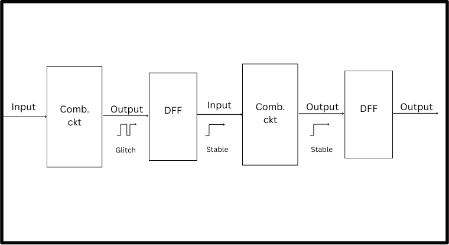

👉 This is the basis of **pipelining** in digital design.

---

## 4. Initialization & Control Pins

Flops need an **initial state**. Without it, downstream circuits may see **garbage values**.

- That’s why flops include **control pins**:
    - **Reset (clear)** – forces the flop to `0`.
    - **Set (preset)** – forces the flop to `1`.

These controls can be:

- **Synchronous** – effective only on the **clock edge**.
- **Asynchronous** – effective **immediately**, independent of the clock.

---

## 5. Summary of Key Concepts

- **Glitches** arise due to unequal propagation delays in combinational circuits.
- **Flops** store values and shield circuits from glitches.
- **Clock edge** triggers state change.
- **Reset/Set pins** define initial states and prevent garbage outputs.
- **Sync/Async control** decides how reset/set behaves with respect to the clock.

---
Let's continue to learn the types of Flops available and it's designing techniques in a new page 👉 [FLOP](FLOP.md)
