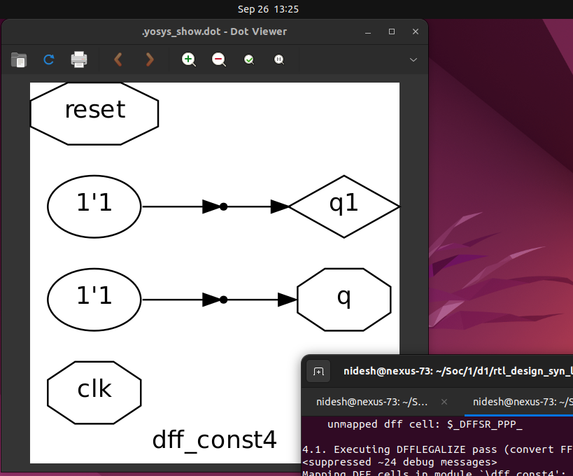

# 📘 Day 3: Combinational & Sequential Logic Optimizations

In digital design, circuits are broadly categorized into:

- **Combinational Logic** – Output depends only on the current input.
- **Sequential Logic** – Output depends on both input and stored states (flip-flops, latches).

In this section, we focus on **combinational logic optimization** – the process of reducing logic complexity while preserving functionality.

---

## 🔎 Why Optimize Combinational Logic?

- **Area Reduction** → Fewer gates/transistors lead to smaller silicon area.
- **Power Savings** → Less switching activity, reduced leakage and dynamic power.
- **Speed Improvement** → Shorter logic paths, lower propagation delay.

Optimization ensures a more **efficient design**, which is crucial in both **ASIC and FPGA flows**.

---

## ⚡ Techniques of Combinational Optimization

1. **Constant Propagation (Direct Optimization)**
    - Replace logic expressions that involve constants with their simplified form.
    - Example Circuit:
        - A 2-input AND gate `(A·B)` feeds into a NOR gate with input `C`.
        - Expression: `Y = ((A·B) + C)'`
        
        Case: If **A = 0**,
        
        ```
        Y = ((0·B) + C)' 
          = (C)' 
        ```
        
- Original requires **6 transistors** (AND + NOR).
- Optimized requires only **2 transistors** (Inverter).


---

1. **Boolean Logic Optimization**
    - Simplify logic expressions using **K-Maps**, **Quine-McCluskey**, or algebraic methods.
    - Example:

```verilog
assign y = a ? (b ? c : (c ? a : 0)) : (!c);
```

- This can be interpreted as a **nested MUX structure**:
    - If `a=1` → Output depends on `b` and `c`.
    - If `a=0` → Output is `!c`.
- After simplification, the result is:

```verilog
Y = A ⊙ C   (Ex-NOR of A and C)
```


---

## ✅ Summary of Combinational Optimizations

| Technique | Description | Benefit |
| --- | --- | --- |
| Constant Propagation | Replace expressions with constant inputs | Reduced gate count & power |
| Boolean Logic Reduction | Use K-map / algebraic simplification | Minimal expression, faster logic |
| MUX-Based Simplification | Convert conditional logic into simpler gates | Area & delay savings |

👉 With these techniques, synthesis tools like **Yosys** automatically recognize and apply optimizations, but understanding them at the logic level helps us **predict, debug, and verify** the synthesized circuits.

# 📘 Sequential Logic Optimizations

Unlike combinational logic, **sequential logic circuits** depend on both **inputs and stored states (flops/latches)**. Optimizing sequential logic is more complex since timing, clocking, and state elements must be preserved.

Optimization techniques can be grouped into **basic** and **advanced** methods.

---

## 🔎 Techniques of Sequential Logic Optimization

### 1️⃣ Sequential Constant Propagation (Basic)

- Similar to combinational constant propagation but applied across **flip-flops**.
- If the output of a flop (`Q`) is always constant (either `0` or `1`), the flop can be removed and replaced with a constant driver.

### Example 1: Optimizable Flop

- A flop has `D = 0` (grounded).
- With `Clk` and `Rst` applied:
    - If reset is active → `Q = 0`.
    - If reset is inactive → `Q = 0` (since D is always 0).
- Therefore, **Q is always 0**, independent of clock/reset.
- If `Q` drives a NAND with input `A`, output `Y` will always be `1` (constant).

✅ This flop can be **removed** during optimization.


---

### Example 2: Non-Optimizable Flop

- A flop with `D=0`, but now with **Set** connected:
    - If Set is applied → Q = 1 (asynchronous).
    - If Set is not applied → Q depends on clock and remains 0.
- Here, `Q` is **not constant** (changes with Set).
- Cannot simplify as a direct constant because there’s a **clock cycle dependency**.

✅ This flop **must be retained**.


---

### 2️⃣ State Optimization

- Sequential machines (FSMs) may have **unused or redundant states**.
- Optimizations include:
    - Removing **unreachable states**.
    - Merging **equivalent states**.
- Saves area and power by reducing the number of flops in the state register.

---

### 3️⃣ Sequential Logic Cloning (Floorplan-Aware Synthesis)

- Applied during **physical-aware synthesis**.
- Suppose flops A, B, C are placed far apart in layout → large routing delay.
- If flop A has **positive slack**, we can duplicate it into two flops:
    - A1 drives B
    - A2 drives C
- Reduces long interconnect delay at the cost of one extra flop.


---

### 4️⃣ Retiming

- Redistributes combinational logic across flops to balance path delays.
- Example:
    - One path has **5 ns delay**, another has **2 ns delay**.
    - Maximum clock frequency = limited by slowest path = **200 MHz**.
- Retiming moves some logic so both paths balance to ~3.5 ns each.
- New maximum frequency improves to **250 MHz**.


✅ Improves performance without changing functionality.

---

✅ Summary of Sequential Optimizations

| Technique | Description | Benefit |
| --- | --- | --- |
| Sequential Const Prop. | Replace flops with constant outputs if always fixed | Gate & power savings |
| State Optimization | Remove unused/redundant states in FSMs | Fewer flops, simpler FSM |
| Logic Cloning | Duplicate flops for physically distant sinks | Reduces routing delay |
| Retiming | Balance logic delays across flops | Higher performance (fmax ↑) |

👉 With sequential optimizations, synthesis tools achieve **better performance, reduced area, and timing closure** in real-world ASIC/FPGA designs.


# 🧪 Lab: Combinational Logic Optimization

In this lab, we will practically verify **logic optimization techniques** using simple Verilog examples.


We will run **Yosys synthesis** with the **Sky130 standard cell library** and observe how redundant logic is simplified.

---

## 1️⃣ Example 1 – `opt_check.v`

### Code:

```verilog
module opt_check (input a , input b , output y);
	assign y = a ? b : 0;
endmodule
```


- This is equivalent to a **2x1 Mux** where:
    
    **y=a?b:0 ==> (!a⋅0)+(a⋅b) ==> a⋅b**
      
- So, the expected optimized circuit is a **2-input AND gate**.


---

## 2️⃣ Example 2 – `opt_check2.v`

### Code:

```verilog
module opt_check2 (input a , input b , output y);
	assign y = a ? 1 : b;
endmodule
```


- Expression:
    
    **y = (!a⋅b)+(a⋅1) ==> a+b**
    
- Optimized result is a **2-input OR gate**.

👉 This process of simplifying Boolean expressions is known as **Boolean Algebra Optimization** (or **Algebraic Simplification**).


---

## 3️⃣ Example 3 – `opt_check3.v`

### Code:

```
module opt_check3 (input a , input b, input c , output y);
	assign y = a ? (c ? b : 0) : 0;
endmodule
```


- Expansion:
    
    **y = (!a⋅0)+a(!c⋅0+c⋅b) = a⋅b⋅c**
    
- Expected optimized result is a **3-input AND gate**.


---

## 4️⃣ Example 4 – `opt_check4.v`

### Code:

```verilog
module opt_check4 (input a , input b , input c , output y);
	assign y = a ? (b ? (a & c) : c) : (!c);
endmodule
```

- After simplification, this reduces to:
    
    **y = a⊙c (XNOR operation between a and c)**
    


---

## 5️⃣ Example 5 – `multiple_module_opt.v`

### Code:

```verilog
module sub_module1(input a , input b , output y);
 assign y = a & b;
endmodule

module sub_module2(input a , input b , output y);
 assign y = a ^ b;
endmodule

module multiple_module_opt(input a , input b , input c , input d , output y);
wire n1,n2,n3;

sub_module1 U1 (.a(a) , .b(1'b1) , .y(n1));
sub_module2 U2 (.a(n1), .b(1'b0) , .y(n2));
sub_module2 U3 (.a(b), .b(d) , .y(n3));

assign y = c | (b & n1); 
endmodule
```


### Observations:

1. `sub_module1` → `y = a & 1 = a`
2. `sub_module2` with `b = 0` → reduces to just `a`
3. Some submodules become redundant.

### Yosys Commands Used:

```verilog
read_liberty -lib ../my_lib/lib/sky130_fd_sc_hd__tt_025C_1v80.lib 
read_verilog multiple_module_opt.v 
synth -top multiple_module_opt 
flatten
opt_clean -purge
abc -liberty ../my_lib/lib/sky130_fd_sc_hd__tt_025C_1v80.lib
show
```

### 🔹 Special Commands Explained

- **`flatten`** → Flattens design hierarchy by replacing module instances with their logic. This exposes optimization opportunities across module boundaries.
- **`opt_clean -purge`** → Removes unused cells, wires, and redundant logic.
- **`abc`** → Performs **technology mapping** and further Boolean optimization using the given `.lib`.


## ✅ Summary of Lab

| File | Initial Description | Optimized Result |
| --- | --- | --- |
| `opt_check.v` | Mux (a?b:0) | AND gate (a&b) |
| `opt_check2.v` | Mux (a?1:b) | OR gate (a+b) |
| `opt_check3.v` | Nested mux (a?(c?b:0):0) | 3-input AND (a·b·c) |
| `opt_check4.v` | Complex mux nesting | XNOR (a ⊙ c) |
| `multiple_module_opt.v` | Hierarchical with redundant submodules | Flattened + reduced to simple logic |

👉 With these labs, we’ve seen how **Boolean simplification, flattening, and clean-up passes** in Yosys lead to **smaller, faster, and more power-efficient** combinational circuits.

# **Sequential Optimization Techniques – Lab**

In this lab, we explore how sequential elements (flip-flops) behave under synthesis when their inputs are constants or simple dependencies. Unlike combinational logic, flip-flops cannot always be optimized away because their operation depends on the **clock edge** and sometimes on **asynchronous reset/set behavior**.

We use the following files for this exercise:

```
$ ls *dff_const*
dff_const1.v  dff_const3.v  dff_const5.v     tb_dff_const2.v  tb_dff_const4.v
dff_const2.v  dff_const4.v  tb_dff_const1.v  tb_dff_const3.v  tb_dff_const5.v
```


## **Example 1 – Constant D Flip-Flop**

File: `dff_const1.v`

```
module dff_const1(input clk, input reset, output reg q);
always @(posedge clk, posedge reset)
begin
	if(reset)
		q <= 1'b0;
	else
		q <= 1'b1;
end
endmodule
```

**Analysis**

- At reset → `q = 0`.
- Else → `q = 1`, but only on the **next clock edge**.
- One might think this reduces to `q = ~reset`, but that’s **not correct**, because of the **clocked nature**.
- The synthesized design **still contains a flip-flop**.

**Simulation Commands**

```verilog
iverilog dff_const1.v tb_dff_const1.v
./a.out
gtkwave tb_dff_const1.vcd
```


**GTKWave (Simulation):**

- At reset → `q=0`.
- After reset deassertion → `q` only goes high **on next rising edge of clk**.
- Confirms this is **not just combinational ~reset**.

**Synthesis Commands**

```verilog
read_liberty -lib ../my_lib/lib/sky130_fd_sc_hd__tt_025C_1v80.lib 
read_verilog dff_const1.v 
synth -top dff_const1 
dfflibmap -liberty ../my_lib/lib/sky130_fd_sc_hd__tt_025C_1v80.lib 
abc -liberty ../my_lib/lib/sky130_fd_sc_hd__tt_025C_1v80.lib
show
```


- Shows a single **DFF cell** with reset pin.
- Confirms that synthesis **retains the flop**.

## **Example 2 – Set Flip-Flop**

File: `dff_const2.v`

```
module dff_const2(input clk, input reset, output reg q);
always @(posedge clk, posedge reset)
begin
	if(reset)
		q <= 1'b1;
	else
		q <= 1'b1;
end
endmodule
```

**Analysis**

- Regardless of `clk`, `q = 1`.
- Here reset acts as a **set pin**.
- Optimized design is just a constant driver to `q`.

**Simulation & Synthesis**

```
iverilog dff_const2.v tb_dff_const2.v
./a.out
gtkwave tb_dff_const2.vcd
```

**GTKWave:**


- Regardless of clk or reset, `q=1` permanently.
- Simulation confirms no toggling.

**Yosys Schematic:**


- Simplified to a **constant driver (1’b1)**.
- **No flop cell** in the netlist.

---

## **Example 3 – Two Flops in Series**

File: `dff_const3.v`

```verilog
module dff_const3(input clk, input reset, output reg q);
reg q1;

always @(posedge clk, posedge reset)
begin
	if(reset)
	begin
		q <= 1'b1;
		q1 <= 1'b0;
	end
	else
	begin
		q1 <= 1'b1;
		q <= q1;
	end
end
endmodule
```

**Analysis**

- Two flip-flops share `clk` and `reset`.
- At reset: `q=1`, `q1=0`.
- On clock edge: `q1 → 1`, `q → q1`.
- `q` samples `q1` with **one cycle latency**.
- Result: `q` ≠ constant → **cannot be optimized away**.

**GTKWave:**


- Reset: `q=1`, `q1=0`.
- On first clk edge after reset: `q1→1`, `q→0`.
- On second clk edge: `q→1`.
- Shows **one cycle delay** between `q1` and `q`.

**Yosys Schematic:**


- One flop mapped as **reset flop**.
- Second flop mapped as **set flop**.
- Inverter added internally for control signals.
- Two flip-flops visible.
- One mapped to reset flop, another to set flop.
- Matches GTKWave timing (q1 → q delay).

## **Example 4 – Constant Registers**

File: `dff_const4.v`

```
module dff_const4(input clk, input reset, output reg q);
reg q1;

always @(posedge clk, posedge reset)
begin
	if(reset)
	begin
		q <= 1'b1;
		q1 <= 1'b1;
	end
	else
	begin
		q1 <= 1'b1;
		q <= q1;
	end
end
endmodule
```

**Analysis**

- Both `q` and `q1` tied to constant `1`.
- During synthesis: **no flops inferred**.


**GTKWave:**


- `q` and `q1` always 1 after reset.
- Behaves like constants.

**Yosys Report**

```
=== dff_const4 ===
   Number of cells: 0
```



**Yosys Schematic:**

- Optimized completely to constants.
- **No flop cells** in final netlist.

---

## **Example 5 – Reset + Latched Constant**

File: `dff_const5.v`

```verilog
module dff_const5(input clk, input reset, output reg q);
reg q1;

always @(posedge clk, posedge reset)
begin
	if(reset)
	begin
		q <= 1'b0;
		q1 <= 1'b0;
	end
	else
	begin
		q1 <= 1'b1;
		q <= q1;
	end
end
endmodule
```

**Analysis**

- On reset: both `q` and `q1 = 0`.
- On next clock: `q1 → 1`, `q → q1`.
- Effectively a **2-stage DFF chain** with initial reset.
- **Cannot optimize** due to dependency.

**GTKWave:**


- Reset: `q=0`, `q1=0`.
- Next clk: `q1=1`, `q=0`.
- Next clk: `q=1`.
- Again a **one cycle delay** visible.

**Synthesis Log**

```verilog
=== dff_const5 ===
   Number of cells: 2
   $_DFF_PP0_  2
```

**Yosys Schematic:**


- Two flops mapped (`sky130_fd_sc_hd__dfrtp_1`).
- Matches the sequential behavior in GTKWave.

---

## **Key Special Yosys Commands**

1. **`dfflibmap`**
    - Maps generic flip-flops (`$_DFF_*`) to actual standard cell DFFs from the technology library.
2. **`abc`**
    - Performs sequential & combinational logic optimization, considering timing constraints of the library.
3. **`show`**
    - Generates schematic to visually verify the optimized netlist.

---

✅ **Summary**

- Sequential optimization differs from combinational since flops are edge-sensitive.
- Constant inputs don’t always eliminate flops.
- Some designs reduce to constants (`dff_const2`, `dff_const4`).
- Others must retain flops due to timing dependencies (`dff_const1`, `dff_const3`, `dff_const5`).

---
# **🛠️ Unused Outputs Optimization Technique**

In this section, we explore **Unused Outputs Optimization** and understand how synthesis tools remove unnecessary logic to reduce area, power, and improve efficiency.

---

## **🔹 Unused Outputs Optimization Lab**

We will use the following Verilog files:

```
counter_opt.v
counter_opt2.v

```

---

### **Example 1 – counter_opt.v**

**Code Overview:**

```verilog
module counter_opt (input clk , input reset , output q);
reg [2:0] count;
assign q = count[0];

always @(posedge clk ,posedge reset)
begin
	if(reset)
		count <= 3'b000;
	else
		count <= count + 1;
end
endmodule

```

**Analysis:**

- 3-bit internal counter: `count[2:0]`
- Primary output `q` only connected to **LSB `count[0]`**.
- **Unused bits** `count[1]` and `count[2]` do not influence any output.

**Behavior:**

- Counter increments 0 → 7, rolls back to 0.
- Only `count[0]` toggles output every clock cycle.
- Other bits are unnecessary for this output.

**Synthesis in Yosys:**

```bash
read_liberty -lib ../my_lib/lib/sky130_fd_sc_hd__tt_025C_1v80.lib
read_verilog counter_opt.v
synth -top counter_opt
dfflibmap -liberty ../my_lib/lib/sky130_fd_sc_hd__tt_025C_1v80.lib
abc -liberty ../my_lib/lib/sky130_fd_sc_hd__tt_025C_1v80.lib
show
```


**Observation:**

- ✅ Only **one DFF** is retained for `count[0]` (reset flop).
- `count[1]` and `count[2]` are removed.
- An **inverter** connected to `count[0]` forms a **toggle DFF**, acting as a 1-bit counter.


**Special Yosys Commands Used:**

- `dfflibmap`: Maps DFFs to technology library cells.
- `abc`: Performs logic optimization including removing unused outputs.
- `show`: Visualizes the synthesized netlist.

---

### **Example 2 – counter_opt2.v**

**Code Overview:**

```verilog
module counter_opt (input clk , input reset , output q);
reg [2:0] count;
assign q = (count[2:0] == 3'b100);

always @(posedge clk ,posedge reset)
begin
	if(reset)
		count <= 3'b000;
	else
		count <= count + 1;
end
endmodule

```

**Analysis:**

- All **3 bits of the counter** are used to generate the output `q`.
- Output is high only when `count` equals 3’b100.

**Synthesis in Yosys:**

```bash
read_liberty -lib ../my_lib/lib/sky130_fd_sc_hd__tt_025C_1v80.lib
read_verilog counter_opt2.v
synth -top counter_opt
dfflibmap -liberty ../my_lib/lib/sky130_fd_sc_hd__tt_025C_1v80.lib
abc -liberty ../my_lib/lib/sky130_fd_sc_hd__tt_025C_1v80.lib
show
```


**Observation:**

- ✅ All **3 DFFs** are retained.
- Output `q` generated by a **3-input NOR gate**:
    
    ```
    q = count[2] & ~count[1] & ~count[0]
    
    ```
    
- All bits contribute to the logic; no bits are optimized away.


---

### **💡 Key Takeaways**

1. **Unused Output Optimization**:
    - Removes logic that does not affect primary outputs.
    - Reduces unnecessary DFFs and combinational logic.
2. **Behavioral Impact**:
    - Logic connected to unused intermediate signals is completely removed.
    - Optimized netlist retains only logic that **affects primary outputs**.
3. **Yosys Commands for Optimization**:
    - `synth` → Synthesizes the top-level design.
    - `dfflibmap` → Maps flip-flops to technology cells.
    - `abc` → Optimizes logic including removing unused outputs.
    - `show` → Visual schematic display.
4. **Practical Importance**:
    - Reduces area, power consumption, and complexity.
    - Ensures that only the **required storage and combinational logic** are implemented in silicon.

---

### **📌 Counter Summary Table**

| Design File | DFFs Retained | Logic Optimized | Notes |
| --- | --- | --- | --- |
| counter_opt.v | 1 | count[1,2] | Only LSB used → others removed |
| counter_opt2.v | 3 | None | All bits used → no optimization |

---

## **✅ Conclusion of Day 3**

- Learned **Combinational Logic Optimization** using Boolean simplification.
- Understood **Sequential Optimization Techniques** (Reset, Set, Constant Flops).
- Explored **Unused Output Optimization**, where logic not affecting outputs is removed.
- **Hands-on Yosys lab** provided experience in visualizing optimized netlists and understanding how synthesis tools optimize RTL designs.

---

🔜 Moving to Day 4: Advanced RTL Concepts & Gate-Level Simulation

Tomorrow we will continue building on Day 3 and explore:

GLS – Gate-Level Simulation 🖥️
Understand how your synthesized netlist behaves with actual gate delays.

Blocking vs Non-Blocking Assignments ⚡
Learn how these affect sequential logic, simulation order, and potential race conditions.

Synthesis vs Simulation Mismatch 🔍
Identify why some RTL constructs work differently after synthesis and how to avoid pitfalls.

These topics are essential for timing analysis, RTL verification, and ensuring your design behaves correctly after synthesis.

👉 All Day 4 examples and labs will be here: 
---
