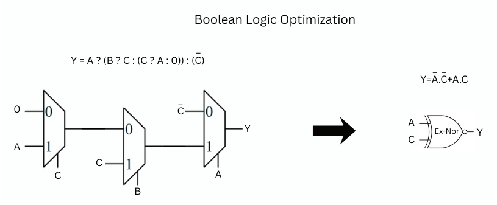

# 📘 Day 3: Combinational & Sequential Logic Optimizations

In digital design, circuits are broadly categorized into:

- **Combinational Logic** – Output depends only on the current input.
- **Sequential Logic** – Output depends on both input and stored states (flip-flops, latches).

In this section, we focus on **combinational logic optimization** – the process of reducing logic complexity while preserving functionality.

---

## 🔎 Why Optimize Combinational Logic?

- **Area Reduction** → Fewer gates/transistors lead to smaller silicon area.
- **Power Savings** → Less switching activity, reduced leakage and dynamic power.
- **Speed Improvement** → Shorter logic paths, lower propagation delay.

Optimization ensures a more **efficient design**, which is crucial in both **ASIC and FPGA flows**.

---

## ⚡ Techniques of Combinational Optimization

1. **Constant Propagation (Direct Optimization)**
    - Replace logic expressions that involve constants with their simplified form.
    - Example Circuit:
        - A 2-input AND gate `(A·B)` feeds into a NOR gate with input `C`.
        - Expression: `Y = ((A·B) + C)'`
        
        Case: If **A = 0**,
        
        ```
        Y = ((0·B) + C)' 
          = (C)' 
        ```
        
- Original requires **6 transistors** (AND + NOR).
- Optimized requires only **2 transistors** (Inverter).


---

1. **Boolean Logic Optimization**
    - Simplify logic expressions using **K-Maps**, **Quine-McCluskey**, or algebraic methods.
    - Example:

```verilog
assign y = a ? (b ? c : (c ? a : 0)) : (!c);
```

- This can be interpreted as a **nested MUX structure**:
    - If `a=1` → Output depends on `b` and `c`.
    - If `a=0` → Output is `!c`.
- After simplification, the result is:

```verilog
Y = A ⊙ C   (Ex-NOR of A and C)
```



---

## ✅ Summary of Combinational Optimizations

| Technique | Description | Benefit |
| --- | --- | --- |
| Constant Propagation | Replace expressions with constant inputs | Reduced gate count & power |
| Boolean Logic Reduction | Use K-map / algebraic simplification | Minimal expression, faster logic |
| MUX-Based Simplification | Convert conditional logic into simpler gates | Area & delay savings |

👉 With these techniques, synthesis tools like **Yosys** automatically recognize and apply optimizations, but understanding them at the logic level helps us **predict, debug, and verify** the synthesized circuits.

# 📘 Sequential Logic Optimizations

Unlike combinational logic, **sequential logic circuits** depend on both **inputs and stored states (flops/latches)**. Optimizing sequential logic is more complex since timing, clocking, and state elements must be preserved.

Optimization techniques can be grouped into **basic** and **advanced** methods.

---

## 🔎 Techniques of Sequential Logic Optimization

### 1️⃣ Sequential Constant Propagation (Basic)

- Similar to combinational constant propagation but applied across **flip-flops**.
- If the output of a flop (`Q`) is always constant (either `0` or `1`), the flop can be removed and replaced with a constant driver.

### Example 1: Optimizable Flop

- A flop has `D = 0` (grounded).
- With `Clk` and `Rst` applied:
    - If reset is active → `Q = 0`.
    - If reset is inactive → `Q = 0` (since D is always 0).
- Therefore, **Q is always 0**, independent of clock/reset.
- If `Q` drives a NAND with input `A`, output `Y` will always be `1` (constant).

✅ This flop can be **removed** during optimization.


---

### Example 2: Non-Optimizable Flop

- A flop with `D=0`, but now with **Set** connected:
    - If Set is applied → Q = 1 (asynchronous).
    - If Set is not applied → Q depends on clock and remains 0.
- Here, `Q` is **not constant** (changes with Set).
- Cannot simplify as a direct constant because there’s a **clock cycle dependency**.

✅ This flop **must be retained**.


---

### 2️⃣ State Optimization

- Sequential machines (FSMs) may have **unused or redundant states**.
- Optimizations include:
    - Removing **unreachable states**.
    - Merging **equivalent states**.
- Saves area and power by reducing the number of flops in the state register.

---

### 3️⃣ Sequential Logic Cloning (Floorplan-Aware Synthesis)

- Applied during **physical-aware synthesis**.
- Suppose flops A, B, C are placed far apart in layout → large routing delay.
- If flop A has **positive slack**, we can duplicate it into two flops:
    - A1 drives B
    - A2 drives C
- Reduces long interconnect delay at the cost of one extra flop.


---

### 4️⃣ Retiming

- Redistributes combinational logic across flops to balance path delays.
- Example:
    - One path has **5 ns delay**, another has **2 ns delay**.
    - Maximum clock frequency = limited by slowest path = **200 MHz**.
- Retiming moves some logic so both paths balance to ~3.5 ns each.
- New maximum frequency improves to **250 MHz**.


✅ Improves performance without changing functionality.

---

✅ Summary of Sequential Optimizations

| Technique | Description | Benefit |
| --- | --- | --- |
| Sequential Const Prop. | Replace flops with constant outputs if always fixed | Gate & power savings |
| State Optimization | Remove unused/redundant states in FSMs | Fewer flops, simpler FSM |
| Logic Cloning | Duplicate flops for physically distant sinks | Reduces routing delay |
| Retiming | Balance logic delays across flops | Higher performance (fmax ↑) |

👉 With sequential optimizations, synthesis tools achieve **better performance, reduced area, and timing closure** in real-world ASIC/FPGA designs.
