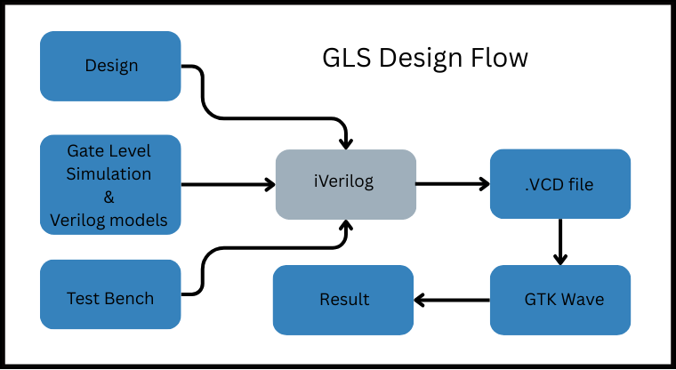
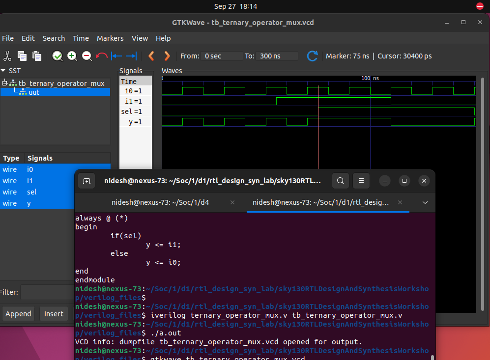
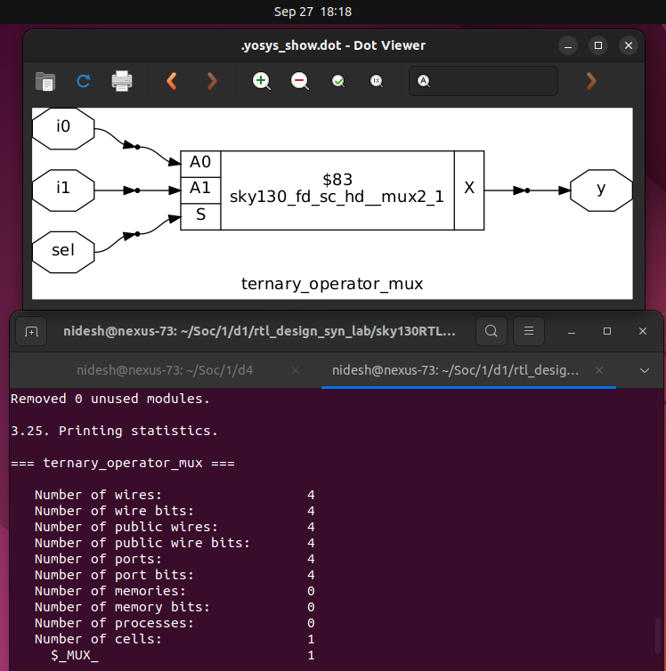
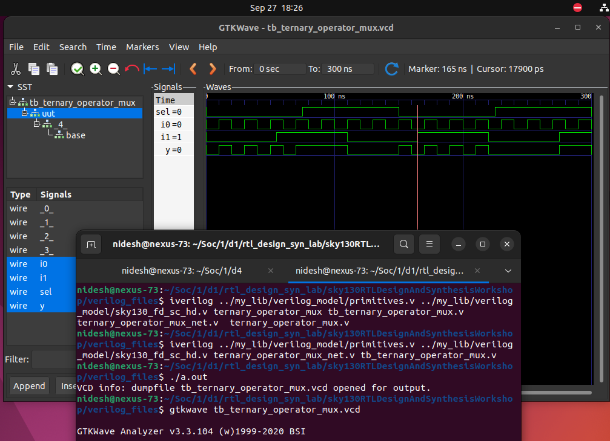
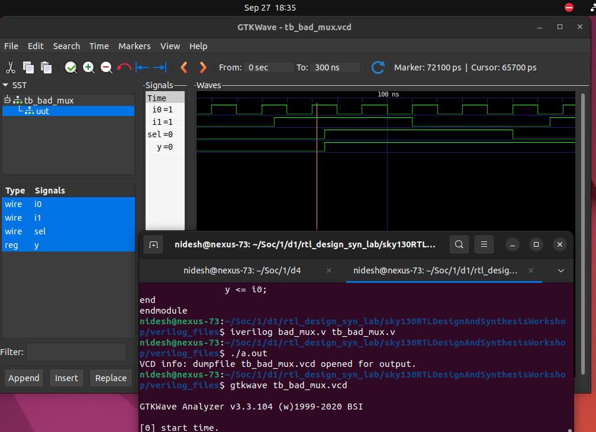
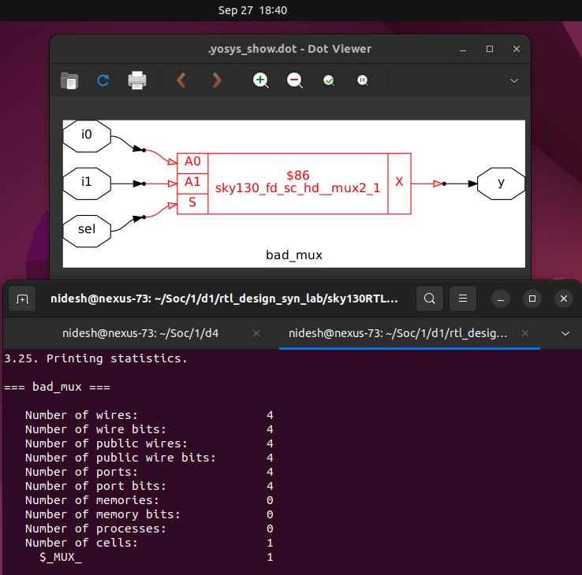
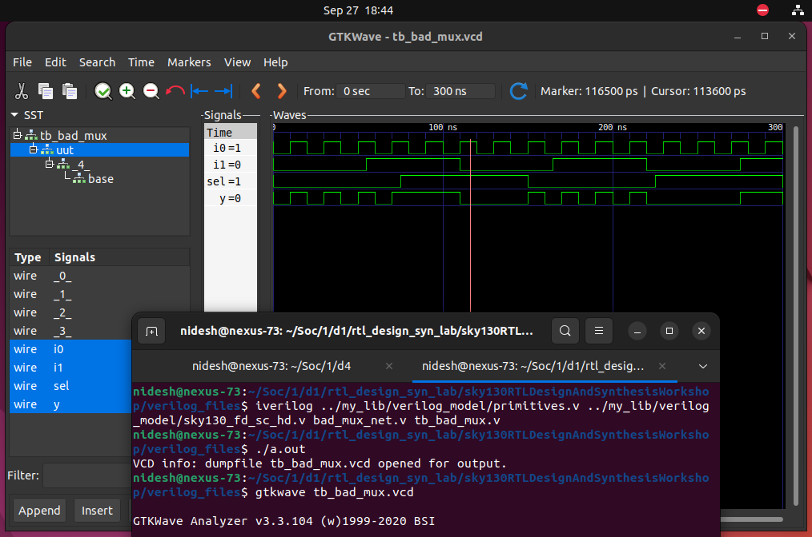
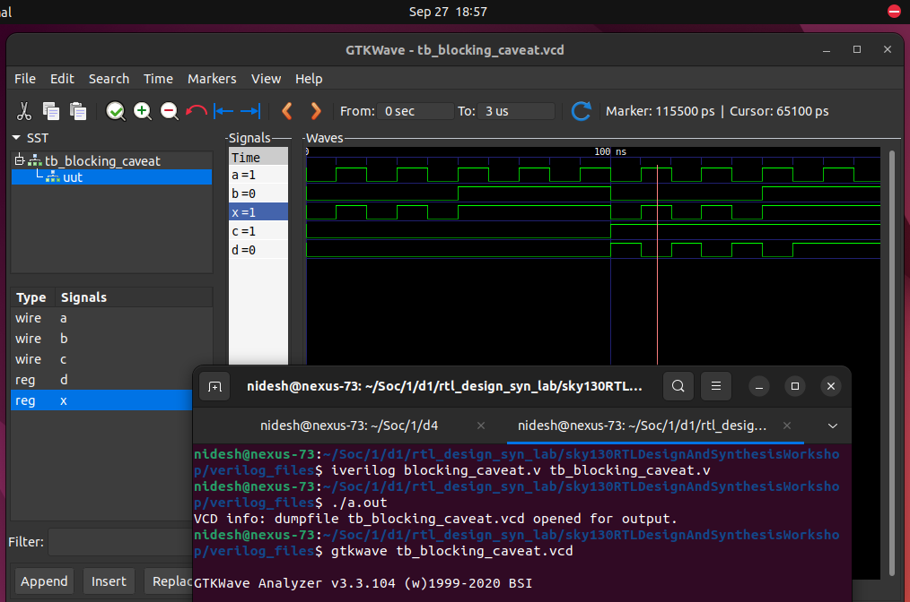
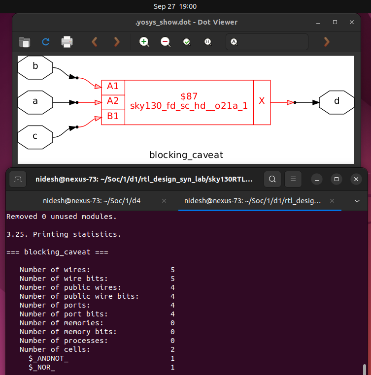
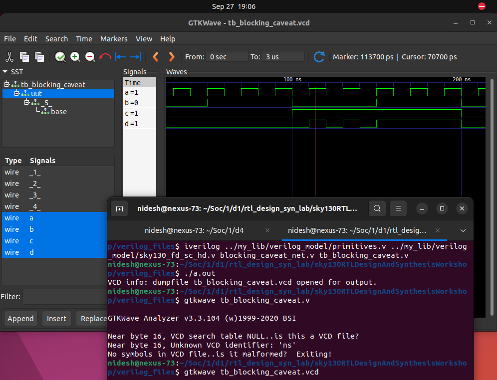

# 📘 Day 4: Gate-Level Simulation (GLS) & Simulation-Synthesis Mismatches

In this session, we are going to explore **Gate Level Simulation (GLS)** and one of the most critical verification aspects in digital design: **Synthesis-Simulation Mismatches**.


---

## 🔎 What is GLS?

**Gate-Level Simulation (GLS)** is the process of validating the synthesized **netlist** using the **same testbench** that was originally written for RTL.

- 🏗️ **Design Under Test (DUT)** → Instead of the RTL, the **netlist** (post-synthesis design) is used.
- 🔄 **Logical Equivalence** → The netlist is *logically equivalent* to the RTL design but expressed in terms of **AND, OR, DFF, MUX, etc. cells** from the standard cell library.
- 🧪 **Same Testbench** → The exact same testbench aligns with the netlist, so no changes are needed on the verification side.

👉 In simple words, GLS ensures that the hardware structure synthesized by tools still behaves exactly like the RTL description when stimulated with the same inputs.

---

## 🎯 Why GLS?

Running GLS is **essential** for multiple reasons:

1. ✅ **Verify Logical Correctness** → Confirms that the synthesized design (netlist) still performs the intended functionality.
2. ⏱️ **Timing Validation** → If the standard cell models are **delay-annotated**, GLS ensures the design meets timing requirements.
3. 🔍 **Catch Mismatches Early** → Helps identify **simulation-synthesis mismatches** caused by poor RTL coding practices.

---

## ⚙️ GLS Flow using Icarus Verilog

To run GLS, we need:

1. **Testbench** (same as used in RTL simulation).
2. **Design Netlist** (post-synthesis Verilog).
3. **Gate-Level Verilog Models** (from the standard cell library, providing functionality and optionally timing).

Steps:

- Compile the testbench + netlist + gate-level models with `iverilog`.
- Generate a `.vcd` waveform file.
- Open the `.vcd` in **GTKWave** for analysis.

📌 **Note:** If the gate-level models include delays, GLS becomes **timing-aware**, making it possible to check setup/hold requirements and clock-to-output delays.

---

## 🧩 Example Design

Consider the following RTL snippet:

```verilog
assign y = (a & b) | c;

```

After synthesis, the netlist may look like this:

```verilog
and u_and (.a(a), .b(b), .y(i0));
or  u_or  (.a(i0), .b(c), .y(y));

```

- Here, the **AND** and **OR** gates are not RTL operators anymore but actual **cell instances**.
- The behavior of these gates is defined inside the **Gate-Level Verilog Models**.
- Depending on the library, these models can be:
    - **Functional only** (logical behavior).
    - **Functional + Timing** (delays, setup/hold checks).

---

# ⚠️ Common Sources of Synthesis-Simulation Mismatch

Even though synthesis ensures logical equivalence, simulation mismatches can occur due to **RTL coding style issues**.

Two of the most frequent culprits are:

1. **Missing Sensitivity List**
2. **Improper Use of Blocking vs Non-Blocking Assignments**

Let’s explore each with examples.

---

## 🛑 1. Missing Sensitivity List

### 📝 Example: MUX with Incorrect Sensitivity

```verilog
module mux (
  input  i0, i1,
  input  sel,
  output reg y
);

always @(sel) begin
  if (sel)
    y = i1;
  else
    y = i0;
end

endmodule

```

- **Problem:**
    
    The `always @(sel)` block only triggers when `sel` changes.
    
    - If `i0` or `i1` changes while `sel` is constant, **`y` will not update**.
    - This creates unintended behavior where the output looks like a **latch** or even a **flop-like element** in RTL simulation.

### 🔍 Why This Happens

- Simulation is **event-driven**: the block executes only when signals in the sensitivity list change.
- Since `i0` and `i1` are missing, their activity is ignored.

### ✅ Fix: Use `always @(*)`

```verilog
always @(*) begin
  if (sel)
    y = i1;
  else
    y = i0;
end

```

- `always @(*)` automatically includes all signals used in the block.
- This ensures correct **combinational behavior** in both simulation and synthesis.

⚡ **Key Point:**

- The **synthesizer doesn’t care about sensitivity lists** (it infers the intended MUX from logic).
- But the **simulator does care**, so missing signals can create mismatches.

---

## 🔄 2. Blocking vs Non-Blocking Assignments

### 📌 Basics

- **Blocking (`=`):** Executes sequentially, like C code. One statement must finish before the next starts.
- **Non-Blocking (`<=`):** All RHS are evaluated first, then LHS updates happen *simultaneously*.

👉 These are only relevant **inside `always` blocks**.

---

### ⚡ Example 1: Shift Register with Blocking

```verilog
module shift_reg (
  input clk, reset, d,
  output reg q
);

reg q0;

always @(posedge clk, posedge reset) begin
  if (reset) begin
    q0 = 1'b0;
    q  = 1'b0;
  end else begin
    q  = q0;
    q0 = d;
  end
end

endmodule

```

### 🔍 Problem

- Intention: 2 flip-flops in series (`D → q0 → q`).
- With **blocking (`=`)**, the order of assignments matters:
    - `q = q0; q0 = d;` → `q` gets the *old* `q0` (✅ correct).
    - `q0 = d; q = q0;` → `q` gets the *new* `q0` (⛔ only one flop).

Thus, simulation may show **one flop instead of two** depending on coding order.

---

### ✅ Fix: Use Non-Blocking

```verilog
always @(posedge clk, posedge reset) begin
  if (reset) begin
    q0 <= 1'b0;
    q  <= 1'b0;
  end else begin
    q0 <= d;
    q  <= q0;
  end
end

```

- With `<=`, both assignments are evaluated simultaneously.
- Ensures **two flops**, order-independent.

👉 **Rule of Thumb:**

- Use **non-blocking (`<=`)** for sequential logic.
- Use **blocking (`=`)** for combinational logic inside `always @(*)`.

---

### ⚡ Example 2: Wrong Ordering in Combinational Logic

```verilog
module comb_logic (
  input a, b, c,
  output reg y
);

reg q0;

always @(*) begin
  y  = q0 & c;
  q0 = a | b;
end

endmodule

```

### 🔍 Problem

- Target circuit: `(a | b) & c`.
- But simulation executes step by step:
    - First → `y = q0 & c;` (uses **old q0**)
    - Then → `q0 = a | b;`

This mimics a **1-cycle delay (like a flop)** in simulation.

### ✅ Fix

```verilog
always @(*) begin
  q0 = a | b;
  y  = q0 & c;
end

```

- Now `y` uses the **new q0**, behaving as intended.
- Synthesis result is identical in both cases, but **simulation differs**.

---

## 🚨 Why GLS Helps Here

- RTL sim may mislead you into thinking your design works.
- Netlist sim (GLS) removes ambiguity since logic is mapped to **gates**.
- This is why GLS is **mandatory** before tapeout or FPGA deployment.

---

# **🧪 Day lab – Gate-Level Simulation (GLS) & Simulation–Synthesis Mismatch**

In this session, we’ll perform **Gate-Level Simulation (GLS)** and explore **why mismatches can occur between RTL simulation and post-synthesis netlist simulation**.

---

## **🔄 Refresh**

- GLS means running the **same testbench** but replacing the RTL **Design Under Test (DUT)** with the **synthesized netlist**.
- Netlist = collection of gates and flip-flops connected together, logically equivalent to RTL.
- We also provide the **Standard Cell Verilog Models** (functional or timing-aware) during GLS.
- Purpose:
    - ✅ Verify logical correctness after synthesis
    - ✅ Verify timing correctness if delay-annotated models are used

📌 **Key Concept**: If the netlist is logically the same as RTL, why simulate it?

Because **coding mistakes** in RTL may pass RTL simulation but **fail in GLS**. These are called **Simulation–Synthesis Mismatches**.

---

## **⚙️ Flow for GLS**

1. Write RTL design and testbench.
2. Run **RTL simulation** with Icarus Verilog + GTKWave.
3. Synthesize RTL → Netlist with **Yosys**.
4. Run **GLS** by simulating:
    - Netlist (`_net.v`)
    - Gate-level standard cell models (`sky130_fd_sc_hd.v`, `primitives.v`)
    - Same testbench


---

# **🧑‍💻 Lab 1 – GLS with a Ternary Operator**

### ✅ Step 1: RTL Design

```verilog
module ternary_operator_mux (input i0 , input i1 , input sel , output y);
    assign y = sel ? i1 : i0;
endmodule

```

👉 The ternary operator (`? :`) is syntactic sugar for a **2x1 multiplexer**.

---

### ✅ Step 2: RTL Simulation

```bash
iverilog ternary_operator_mux.v tb_ternary_operator_mux.v
./a.out
gtkwave tb_ternary_operator_mux.vcd

```



---

### ✅ Step 3: Synthesis with Yosys

```
yosys
read_liberty -lib ../my_lib/lib/sky130_fd_sc_hd__tt_025C_1v80.lib
read_verilog ternary_operator_mux.v
synth -top ternary_operator_mux
abc -liberty ../my_lib/lib/sky130_fd_sc_hd__tt_025C_1v80.lib
write_verilog -noattr ternary_operator_mux_net.v
show

```



Yosys log shows RTL mux → **sky130_fd_sc_hd__mux2_1**.

---

### ✅ Step 4: GLS

```bash
iverilog ../my_lib/verilog_model/primitives.v ../my_lib/verilog_model/sky130_fd_sc_hd.v \
ternary_operator_mux_net.v tb_ternary_operator_mux.v
./a.out
gtkwave tb_ternary_operator_mux.vcd

```



---

# **⚠️ Lab 2 – Bad Mux Example (Missing Sensitivity List)**

### ❌ RTL Code

```verilog
module bad_mux (input i0 , input i1 , input sel , output reg y);
always @ (sel) begin
    if (sel)
        y <= i1;
    else
        y <= i0;
end
endmodule

```

Issue:

- RTL sim uses sensitivity list = only `sel`
- Inputs `i0`, `i1` changes won’t re-evaluate `always` block
- Acts like a **latch/flop**, not a mux

---

### ✅ RTL Simulation

```bash
iverilog bad_mux.v tb_bad_mux.v
./a.out
gtkwave tb_bad_mux.vcd

```



---
**Synthesis Result** 



### ✅ GLS Simulation

```bash
iverilog ../my_lib/verilog_model/primitives.v ../my_lib/verilog_model/sky130_fd_sc_hd.v \
bad_mux_net.v tb_bad_mux.v
./a.out
gtkwave tb_bad_mux.vcd

```




👉 **This is a Simulation–Synthesis Mismatch** caused by **missing sensitivity list**.


---

# **⚠️ Lab 3 – Blocking Caveat**

### ❌ RTL Code

```verilog
module blocking_caveat (input a , input b , input c, output reg d);
reg x;
always @ (*) begin
    d = x & c;
    x = a | b;
end
endmodule

```

Problem:

- **Blocking assignment (=)** causes `d` to use **old value of x**.
- Creates mismatch between RTL and GLS.

---

### ✅ RTL Simulation

```bash
iverilog blocking_caveat.v tb_blocking_caveat.v
./a.out
gtkwave tb_blocking_caveat.vcd

```



---
**Yosys Sythesis**



---

### ✅ GLS Simulation

```bash
iverilog ../my_lib/verilog_model/primitives.v ../my_lib/verilog_model/sky130_fd_sc_hd.v \
blocking_caveat_net.v tb_blocking_caveat.v
./a.out
gtkwave tb_blocking_caveat.vcd

```



👉 Mismatch caused by **Blocking Assignment**. Use **Non-Blocking (`<=`)** instead.

---

# **📊 Day 4 Summary**

- ✅ **GLS = running testbench on synthesized netlist**
- ✅ Needed to catch **Simulation–Synthesis Mismatches**
- ⚠️ Common causes of mismatches:
    - Missing sensitivity list
    - Blocking vs Non-Blocking assignments
    - Non-standard coding practices
- ✅ Always **use good RTL coding style** to avoid issues


---

# **🔜 Moving to Day 5: Optimizations in Synthesis**

Now that we’ve seen how GLS uncovers mismatches, the next step is **RTL coding optimizations**:

- **If-case constructs**
- **Incomplete vs complete cases**
- **Overlapping cases**
- **For loop vs For generate**

👉 Let’s begin **Day 5 with Synthesis Optimizations** 🚀

---
