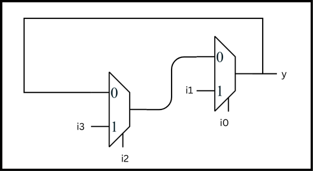
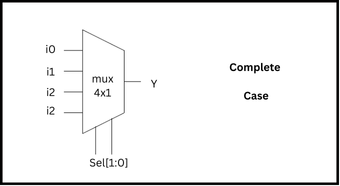

# **📘 Day 5 – Optimization in Synthesis**

## **Introduction**

In digital design, **coding style directly affects the synthesized hardware**. Even a small mistake in RTL can lead to **inferred latches, extra muxes, or unpredictable behavior**. To avoid such issues, it’s important to understand how **`if`** and **`case`** statements translate to hardware during synthesis, and where the common pitfalls lie.

In this section, we’ll discuss:

- How **`if` statements** create **priority logic**
- How **`case` statements** create **multiplexers**
- Dangers of **incomplete assignments** and **overlapping cases**
- Best practices to avoid **unwanted inferred latches**

---

## **1. If Statement – Priority Logic**

An **`if` block** is mainly used to design **priority logic**.

### **Syntax**:

```verilog
if (condition) begin
   // statements
end
else begin
   // statements
end

```

👉 Clearly, the **`if` condition has more priority** over the `else`.

---

### **Example – Nested If**

```verilog
if (cond1)
   ...
else if (cond2)
   ...
else if (cond3)
   ...
else
   ...

```

### **Hardware View**

This structure translates into a **chain of multiplexers**:

- First MUX controlled by `cond1`
- If `cond1=0`, another MUX for `cond2`
- If `cond2=0`, another MUX for `cond3`
- Finally, the **default** path when none are true


---

### **Danger: Inferred Latches**

If an **`if` statement is incomplete**, synthesis tools will generate a **latch** to store the previous value. This happens because the hardware doesn’t know what to assign when no condition is met.

### **Example – Problematic Code**

```verilog
if (cond1)
   y = a;
else if (cond2)
   y = b;
// missing else !!!

```


### **Hardware Explanation**

- When `cond1=1`, output is `a`
- When `cond2=1`, output is `b`
- When both are 0, output is **undefined** → synthesis inserts a **latch** to hold the last value

⚠️ This is **undesirable** in combinational logic.

---

### **Exception: Sequential Logic (Counters, Registers)**

Sometimes incomplete `if` is acceptable, e.g., counters:

```verilog
always @(posedge clk or posedge reset) begin
   if (reset)
      count <= 3'b000;
   else if (en)
      count <= count + 1;
end

```


Here, the “incomplete if” is **intentional** because the register must hold the previous value when `en=0`.

**Rule of Thumb**:

- **Combinational blocks → Always cover all conditions**
- **Sequential blocks → Holding previous value is fine**

---

# **Day 5 – Optimization in Synthesis (Lab on If statements)**

## **Lab Files Used**

From the lab folder:

```
incomp_case.v   incomp_if.v       tb_incomp_if2.v
incomp_if2.v    tb_incomp_case.v  tb_incomp_if.v

```

We’ll first explore **incomplete if statements** and see how they lead to **latches**.

---

## **Example 1: `incomp_if.v`**

### **Code**

```verilog
module incomp_if (input i0 , input i1 , input i2 , output reg y);
always @ (*)
begin
   if(i0)
      y <= i1;
end
endmodule

```

### **Explanation**

- If `i0=1`, then `y = i1`
- If `i0=0`, **no assignment → latch behavior**
- This is equivalent to a **D latch**:
    - `i0` = Enable
    - `i1` = D input
    - `y` = Q output


---

### **Simulation**

```bash
iverilog incomp_if.v tb_incomp_if.v
./a.out
gtkwave tb_incomp_if.vcd

```

👉 **Observation**:

When `i0=0`, output `y` **retains the previous value** instead of going to 0.


---

### **Synthesis**

```bash
read_liberty -lib ../my_lib/lib/sky130_fd_sc_hd__tt_025C_1v80.lib
read_verilog incomp_if.v
synth -top incomp_if
abc -liberty ../my_lib/lib/sky130_fd_sc_hd__tt_025C_1v80.lib
show

```

📌 **Synthesis Result**:

```
Number of cells: 1
   $_DLATCH_P_   1

```


⚠️ We expected a **MUX**, but synthesis inferred a **Latch**.

This confirms the **danger of incomplete if**.

---

## **Example 2: `incomp_if2.v`**

### **Code**

```verilog
module incomp_if2 (input i0 , input i1 , input i2 , input i3, output reg y);
always @ (*)
begin
   if(i0)
      y <= i1;
   else if (i2)
      y <= i3;
end
endmodule

```

### **Explanation**

- If `i0=1` → `y = i1`
- Else if `i2=1` → `y = i3`
- Else → **no assignment → inferred latch**



---

### **Simulation**

```bash
iverilog incomp_if2.v tb_incomp_if2.v
./a.out
gtkwave tb_incomp_if2.vcd

```

👉 **Observation**:

When both `i0=0` and `i2=0`, output `y` **remains latched**.


---

### **Synthesis**

```bash
read_liberty -lib ../my_lib/lib/sky130_fd_sc_hd__tt_025C_1v80.lib
read_verilog incomp_if2.v
synth -top incomp_if2
abc -liberty ../my_lib/lib/sky130_fd_sc_hd__tt_025C_1v80.lib
show

```

📌 **Synthesis Result**:

```
Number of cells: 3
   $_DLATCH_N_   1
   $_MUX_        1
   $_NOR_        1

```


This matches our expectation:

- MUX for selecting `i1` or `i3`
- NOR + latch for the case when no condition is satisfied

---

## **Key Takeaway**

- **Incomplete If = Inferred Latch**
- Always ensure that **all conditions are covered** in combinational logic
- Use `else` to provide a **default assignment** and avoid latches

---

👉 Next, we will extend this lab to **Case statements** and study similar pitfalls (incomplete case, partial assignment, overlapping case).

---

# **Case-statement Pitfalls** (Incomplete / Partial / Overlapping Cases) 🧩

This section walks through *why* bad `case` coding creates inferred latches, partial/overlapping behavior, how it shows up in simulation vs synthesis, and how to fix it.

---

## Lab files used

```
bad_case_net.v  incomp_case.v          tb_demux_case.v
bad_case.v      incomp_case.v          tb_incomp_case.v
comp_case.v     partial_case_assign.v  tb_comp_case.v
demux_case.v    tb_bad_case.v          tb_partial_case_assign.v
```

---

## Quick command cheatsheet (what we run)

Simulation (RTL):

```bash
iverilog  <design.v> <tb.v>
./a.out
gtkwave <tb.vcd>
```

Synthesis (Yosys interactive sequence):

```tcl
# inside yosys shell:
read_liberty -lib ../my_lib/lib/sky130_fd_sc_hd__tt_025C_1v80.lib
read_verilog <design.v>
synth -top <top_module>
abc -liberty ../my_lib/lib/sky130_fd_sc_hd__tt_025C_1v80.lib
show
write_verilog -noattr <top>_net.v    # optional export
```

Gate-level simulation (GLS) — simulate the netlist with gate models:

```bash
iverilog ../my_lib/verilog_model/primitives.v \
         ../my_lib/verilog_model/sky130_fd_sc_hd.v \
         <top>_net.v \
         <tb.v>
./a.out
gtkwave <tb.vcd>
```

---

## ❗ Background: why `case` can cause latches

A `case` inside an `always @(*)` describes combinational logic **only if** every output assigned inside the `always` is fully assigned for *every* case branch (including a `default`).
If any output is left unassigned for one or more selector values, the synthesizer assumes you intended a memory to **hold** the previous value → **inferred latch**.

---

## Example 1 — **Incomplete case** (`incomp_case.v`) 🔒

### Code

```verilog
module incomp_case (
  input i0, input i1, input i2,
  input [1:0] sel,
  output reg y
);
always @(*)
begin
  case(sel)
    2'b00 : y = i0;
    2'b01 : y = i1;
  endcase
end
endmodule
```

### Behaviour / Explanation


* This is logically a 4→1 MUX (sel[1:0]).
* But `sel == 2'b10` and `2'b11` have **no assignment** to `y`. To preserve the previous `y` value for those cases, a **latch** is inferred.
* In other words: when none of the branches drive `y`, hardware must *remember* the last value → latch.

### Simulation (RTL)

```bash
iverilog incomp_case.v tb_incomp_case.v
./a.out
gtkwave tb_incomp_case.vcd
```


**Observation:** when `sel` is `10` or `11`, `y` holds the previous value (latched).

### Synthesis (Yosys)

```tcl
read_liberty -lib ../my_lib/lib/sky130_fd_sc_hd__tt_025C_1v80.lib
read_verilog incomp_case.v
synth -top incomp_case
abc -liberty ../my_lib/lib/sky130_fd_sc_hd__tt_025C_1v80.lib
show
```


**Synthesis summary (from your run):**

| Item        |                                              Value |
| ----------- | -------------------------------------------------: |
| Cells (key) | `$_DLATCH_N_` (1), `$_MUX_` (1), other logic cells |
| Meaning     |              A latch is present driving output `y` |

**Interpretation:** Yosys inserted a latch cell (`DLATCH`) to hold `y` for selector values that don't assign `y`.

---

### Fix / Best practice

Always provide a `default` branch OR assign a safe default at the start of the `always`:

```verilog
always @(*) begin
  y = 1'b0;     // default value
  case(sel)
    2'b00: y = i0;
    2'b01: y = i1;
    default: y = i2;  // or keep the default
  endcase
end
```

---

## Example 2 — **Complete case** (`comp_case.v`) ✅

### Code

```verilog
module comp_case (input i0, input i1, input i2, input [1:0] sel, output reg y);
always @ (*)
begin
  case(sel)
    2'b00 : y = i0;
    2'b01 : y = i1;
    default : y = i2;
  endcase
end
endmodule
```

### Behaviour / Explanation



* All selector values covered (via `default`) → combinational MUX, **no latch**.

### Simulation

```bash
iverilog comp_case.v tb_comp_case.v
./a.out
gtkwave tb_comp_case.vcd
```


As expected we have switching behavior (no hold/latched values).

### Synthesis

```tcl
read_liberty -lib ../my_lib/lib/sky130_fd_sc_hd__tt_025C_1v80.lib
read_verilog comp_case.v
synth -top comp_case
abc -liberty ../my_lib/lib/sky130_fd_sc_hd__tt_025C_1v80.lib
show
```


**Synthesis summary (from your run):**

| Item        |                                      Value |
| ----------- | -----------------------------------------: |
| Cells (key) |       `$_MUX_` (1), various AND/OR mapping |
| Meaning     | Pure combinational logic (no DLATCH found) |

---

## Example 3 — **Partial assignments in case** (`partial_case_assign.v`) ⚠️

### Code

```verilog
module partial_case_assign (
  input i0, input i1, input i2,
  input [1:0] sel,
  output reg y, output reg x
);
always @ (*)
begin
  case(sel)
    2'b00 : begin
      y = i0;
      x = i2;
    end
    2'b01 : y = i1;             // <-- x not assigned here (partial)
    default : begin
      x = i1;
      y = i2;
    end
  endcase
end
endmodule
```

### Behaviour / Explanation


* **`y`** is assigned in every branch → `y` is combinational.
* **`x`** is *not* assigned in the `2'b01` branch → synthesizer infers a **latch** for `x` to hold its previous value when `sel == 2'b01`.

### Simulation

```bash
iverilog partial_case_assign.v tb_partial_case_assign.v
./a.out
gtkwave tb_partial_case_assign.vcd
```


`x` holds value for the problematic `sel` branch.

### Synthesis

```tcl
read_liberty -lib ../my_lib/lib/sky130_fd_sc_hd__tt_025C_1v80.lib
read_verilog partial_case_assign.v
synth -top partial_case_assign
abc -liberty ../my_lib/lib/sky130_fd_sc_hd__tt_025C_1v80.lib
show
```


**Synthesis summary:**

| Item        |                                                Value |
| ----------- | ---------------------------------------------------: |
| Cells (key) |            `$_DLATCH_P_` (1) — latch present for `x` |
| Meaning     | Partial assignment triggered latch insertion for `x` |

### Fix / Best practice

* **Initialize all outputs at top** of `always` (clear partial assignment):

```verilog
always @(*) begin
  x = some_default;
  y = some_default;
  case(sel)
    ...
  endcase
end
```

* Or ensure each `case` branch assigns **every** output reg.

---

## Example 4 — **Overlapping / wildcard case** (`bad_case.v`) ⚠️ (priority ambiguity)

### Code (excerpt)

```verilog
module bad_case (input i0, i1, i2, i3, input [1:0] sel, output reg y);
always @(*)
begin
  case(sel)
    2'b00: y = i0;
    2'b01: y = i1;
    2'b10: y = i2;
    2'b1?: y = i3;   // overlapping/wildcard pattern
  endcase
end
endmodule
```

### Behaviour / Explanation


* The `2'b1?` (wildcard) overlaps with `2'b10` and `2'b11`. Overlapping patterns can lead to **ambiguous matching order** in simulation depending on how Verilog interprets the wildcard and order of matches — this can produce **unpredictable behavior** in RTL simulation.
* In your run, the RTL simulation showed confusing/latched behavior for `sel == 2'b11`, while Yosys synthesized a clean 4:1 mux (no latch).

### Synthesis & Netlist


* Yosys mapped the logic to a `mux4` cell (see `bad_case_net.v` snippet you produced). No latch was inferred because, during synthesis, Yosys resolved branches into a deterministic mux implementation.

### GLS (netlist sim)

```bash
iverilog ../my_lib/verilog_model/primitives.v ../my_lib/verilog_model/sky130_fd_sc_hd.v bad_case_net.v tb_bad_case.v
./a.out
gtkwave tb_bad_case.vcd
```


Clean mux selection in GLS.

### Takeaway

* **Avoid overlapping/wildcard case patterns** unless you control the exact matching semantics.
* Prefer `case`, `casez`, or `casex` explicitly, and be aware of priority & wildcard rules. In SystemVerilog, `unique`/`priority` qualifiers help make intent explicit.
* If you want strict priority use `if/else` chains instead, which have well-defined sequential priority.

---

## Full synthesis result comparison (summary table)

| Example                 |       RTL behavior | Synthesized hardware                  |          Latch present?          |
| ----------------------- | -----------------: | ------------------------------------- | :------------------------------: |
| `incomp_case.v`         |   4:1 MUX intended | MUX + DLATCH                          |         ✅ yes (`DLATCH`)         |
| `comp_case.v`           |            4:1 MUX | MUX / combinational                   |               ❌ no               |
| `partial_case_assign.v` |      mixed outputs | MUX + DLATCH (for unassigned reg)     |          ✅ yes (for `x`)         |
| `bad_case.v`            | ambiguous/wildcard | Synthesizes to `mux4` (deterministic) | ❌ no (but simulation may differ) |

---

## Coding rules & best practices (short checklist) ✅

* For **combinational** `always @(*)` blocks:

  * Assign **every reg** that appears on the LHS in *every* branch (or set a safe default at the top).
  * Always include a `default` branch in `case`.
* For **priority** behavior use `if/else if/else` (explicitly ordered).
* Avoid wildcard/overlapping `case` patterns unless you fully understand match precedence.
* To express designer intent in SystemVerilog, consider `unique`/`priority` qualifiers (if toolchain supports SV).
* Run **GLS (Gate-Level Simulation)** to catch synthesis-simulation mismatches before signoff.

---

# **🔁 Looping Constructs in Verilog**

In this session, we will explore how **loops** in Verilog can be used both for **behavioral modeling** and **structural hardware generation**.

Verilog provides two important types of looping constructs:

1. **`for` loop** → Used **inside `always` blocks** → for evaluating logic or expressions.
2. **`generate for` loop** → Used **outside `always` blocks** → for **replicating hardware instances**.

---

## **1️⃣ Using `for` Loop (Behavioral)**

👉 The `for` loop is commonly used inside an `always` block to **evaluate logic repetitively**.
It doesn’t instantiate hardware directly, but rather models behavior that tools will optimize into gates.

### Example: **2x1 Multiplexer**

```verilog
always @(*) begin 
   case (sel)
      1'b0: y = i0;
      1'b1: y = i1;
   endcase
end

// OR equivalent shorthand:
assign y = sel ? i1 : i0;
```

✅ Simple and easy for a **2:1 MUX**,
❌ But what if we need a **32:1 MUX**? Writing case statements would be tedious.

---

### Example: **32x1 Multiplexer using `for` loop**

```verilog
integer i;
always @(*) begin
   for (i = 0; i < 32; i = i + 1) begin
      if (i == sel)
         y = input[i];
   end
end
```

✨ With just a few lines, we can scale this to a **32:1 MUX** (or even 256:1 by changing the loop limit).
📉 Saves coding effort, improves readability, and exploits **blocking assignments**.

---

### Example: **Demultiplexer using `for` loop**

```verilog
integer i;
always @(*) begin
   op_bus[7:0] = 8'b0;
   for (i = 0; i < 8; i = i + 1) begin
      if (i == sel)
         op_bus[i] = input;
   end
end
```

💡 This allows a **1-to-8 DEMUX** to be implemented cleanly.

📌 **Key Note:**

* The `for` loop **inside `always`** is for **behavioral evaluation**, not direct hardware replication.
* Synthesis tools expand the logic into multiplexers, decoders, or equivalent gates.

---

## **2️⃣ Using `generate for` Loop (Structural)**

👉 The `generate` construct is used when we want to **instantiate multiple hardware modules or gates** repeatedly.
It is written **outside the `always` block**.

---

### Example: **500 AND Gates Replication**

```verilog
genvar i;
generate 
   for (i = 0; i < 500; i = i + 1) begin
      and u_and(.a(in1[i]), .b(in2[i]), .y(y[i]));
   end
endgenerate
```

✅ Instead of writing 500 instantiations, the `generate` loop creates them automatically.

---

### Example: **Ripple-Carry Adder (RCA)**

In an RCA, each **full adder** takes inputs from the previous stage’s carry:

* `num1[0] + num2[0]` → `sum[0]` and `carry[1]`
* `num1[1] + num2[1]` → `sum[1]` and `carry[2]`
* ... and so on.

We can use a **`for-generate` loop** to instantiate full adders for every bit:

```verilog
genvar j;
generate
   for (j = 0; j < N; j = j + 1) begin : RCA
      full_adder fa (
         .a(num1[j]),
         .b(num2[j]),
         .cin(carry[j]),
         .sum(sum[j]),
         .cout(carry[j+1])
      );
   end
endgenerate
```

📌 **Key Note:**

* `generate` is for **hardware replication**.
* Can also be combined with **if-generate** for conditional hardware inclusion.

---

## **🧪 Lab Examples**

### **4x1 MUX with `for` Loop**

```verilog
module mux_generate (input i0, i1, i2, i3, input [1:0] sel, output reg y);
   wire [3:0] i_int;
   assign i_int = {i3,i2,i1,i0};
   integer k;

   always @(*) begin
      for(k = 0; k < 4; k = k + 1) begin
         if(k == sel)
            y = i_int[k];
      end
   end
endmodule
```

* **Simulation:** Run with `iverilog` + `gtkwave`.
* **Synthesis:** Results in **MUX + latch warnings** if incomplete.

---

### **8x1 DEMUX with `for` Loop**

```verilog
module demux_generate (output o0, o1, o2, o3, o4, o5, o6, o7,
                       input [2:0] sel, input i);
   reg [7:0] y_int;
   assign {o7,o6,o5,o4,o3,o2,o1,o0} = y_int;
   integer k;

   always @(*) begin
      y_int = 8'b0;
      for (k = 0; k < 8; k = k + 1) begin
         if (k == sel)
            y_int[k] = i;
      end
   end
endmodule
```

* **Simulation:** Verify with `tb_demux_generate.v`.

---

## **📌 Conclusion**

* ✅ **`for` loop** → Best for *behavioral modeling* inside `always`.
* ✅ **`generate for` loop** → Best for *hardware replication* (scalable designs).
* ⚠️ Beware of **incomplete if/case statements**, they may infer **latches** unexpectedly.

🚀 With these constructs, we can design **scalable RTL architectures** efficiently.

---

Perfect 👍 Let’s close **Week 1** with a strong summary and then smoothly transition into **Week 2**.

---

# 📅 **Week 1 Summary – RTL Design & Optimizations**

Over the past week, we explored the **core foundations of RTL design and optimization**:

✅ **Day 1 – RTL Basics**

* Learned about RTL design fundamentals.
* Difference between **Combinational** & **Sequential** logic.
* Basic circuit examples & structural understanding.

✅ **Day 2 – Structural Optimizations**

* Arithmetic operation optimizations (Adder, Multiplier, etc.).
* Trade-offs in **area, power, and speed**.
* Importance of structural simplification in real-world SoCs.

✅ **Day 3 – Combinational & Sequential Optimizations**

* **Combinational**: Boolean algebra simplification, constant propagation, redundant logic removal.
* **Sequential**: Retiming, register balancing, removing redundant flops.
* Demonstrated with examples (MUX simplification, constant propagation).

✅ **Day 4 – GLS & Simulation-Synthesis Mismatch**

* **GLS (Gate-Level Simulation):** Running testbenches with netlist DUT.
* **Why GLS?** Post-synthesis correctness & timing validation.
* **Synthesis-Simulation Mismatch:** Causes like missing sensitivity list, blocking vs non-blocking issues, non-standard coding.
* Compared **RTL Simulation vs GLS** in a neat table.

📌 **Key Takeaway of Week 1:**
We’ve built a strong foundation in **RTL design, optimizations, and verification methods**.
This sets the stage for moving from **RTL coding → actual SoC fundamentals**. 🚀

---

# 🔜 **Moving to Week 2: BabySoC Fundamentals & Functional Modelling**

In **Week 2**, we shift focus from pure RTL to the **system-level design view**.
We’ll begin exploring:

* **BabySoC Architecture** (top-level understanding).
* **Functional Modelling of SoC Components**.
* How **RTL blocks map into a complete SoC**.

👉  is where we **connect RTL to the bigger SoC picture**. 🖥️⚡

---

Do you want me to also create a **Week 1 → Week 2 transition banner style (like the day transitions)** with emojis and headings?

